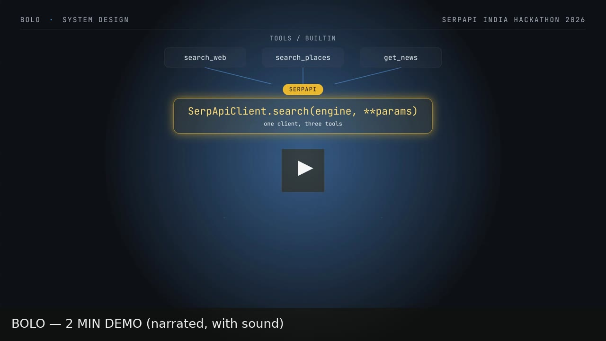
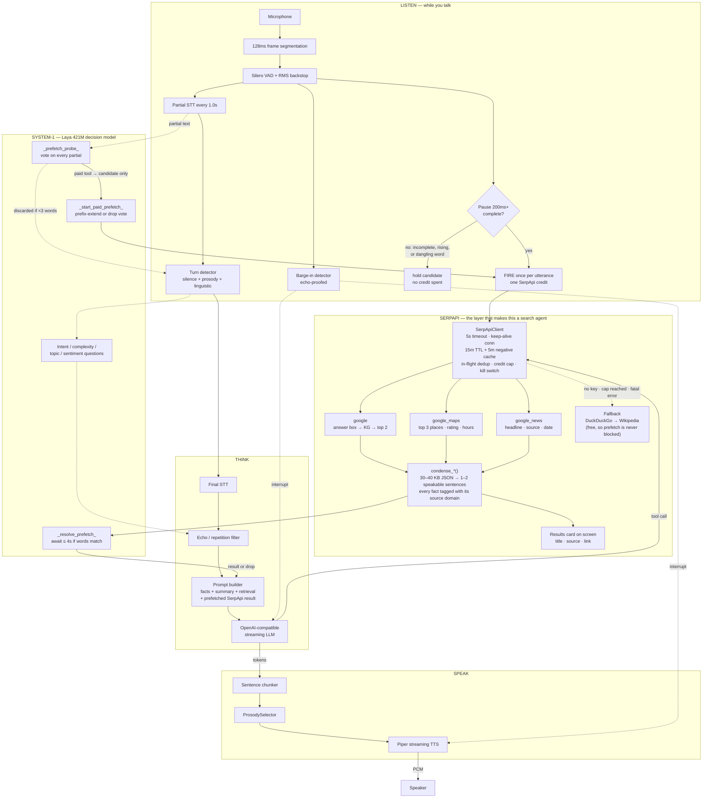

<div align="center">
<div style="width:100%; max-width:900px; margin:0 auto; border:1px solid #21262d; border-radius:14px; overflow:hidden; background:#0d1117;">

<div style="height:3px; background:linear-gradient(90deg,#1f6feb 0%,#58a6ff 45%,#f0b72f 100%);"></div>

<div style="padding:40px 32px 30px;">

<p style="margin:0; font-family:ui-monospace,SFMono-Regular,monospace; font-size:11px; letter-spacing:1.6px; color:#8b949e;">SERPAPI INDIA HACKATHON 2026 &nbsp;&middot;&nbsp; AI AGENTS TRACK</p>

<p style="margin:16px 0 0; line-height:1;"></p>

<p style="font-size:19px; color:#79c0ff; margin:16px auto 0; max-width:660px; line-height:1.45; font-weight:500;">Grounded voice search that starts before you finish speaking.</p>

<p style="font-size:15px; color:#8b949e; margin:18px auto 0; max-width:690px; line-height:1.7;">Bolo is a real-time voice agent that starts searching while you speak. A 421M-parameter decision model evaluates partial transcripts and prefetches the relevant <a href="https://serpapi.com" style="color:#58a6ff; text-decoration:none;">SerpApi</a> query before your sentence ends. Responses are concise, speakable, and grounded in their sources.</p>

<p style="margin:28px auto 0; max-width:720px; font-family:ui-monospace,SFMono-Regular,monospace; font-size:11px; letter-spacing:1.1px;">
<a href="#demo" style="display:inline-block; margin:3px; padding:7px 14px; border:1px solid #f0b72f; border-radius:6px; background:#1c1500; color:#f0b72f; text-decoration:none;">DEMO</a>
<a href="#why" style="display:inline-block; margin:3px; padding:7px 14px; border:1px solid #30363d; border-radius:6px; color:#c9d1d9; text-decoration:none;">HOW IT WORKS</a>
<a href="#quick-start" style="display:inline-block; margin:3px; padding:7px 14px; border:1px solid #30363d; border-radius:6px; color:#c9d1d9; text-decoration:none;">GET STARTED</a>
<a href="#serpapi" style="display:inline-block; margin:3px; padding:7px 14px; border:1px solid #f0b72f; border-radius:6px; background:#1c1500; color:#f0b72f; text-decoration:none;">SEARCH</a>
<a href="#prefetch" style="display:inline-block; margin:3px; padding:7px 14px; border:1px solid #30363d; border-radius:6px; color:#c9d1d9; text-decoration:none;">PREFETCH</a>
<a href="#architecture" style="display:inline-block; margin:3px; padding:7px 14px; border:1px solid #30363d; border-radius:6px; color:#c9d1d9; text-decoration:none;">ARCHITECTURE</a>
<a href="#tools" style="display:inline-block; margin:3px; padding:7px 14px; border:1px solid #30363d; border-radius:6px; color:#c9d1d9; text-decoration:none;">TOOLS</a>
<a href="#benchmark" style="display:inline-block; margin:3px; padding:7px 14px; border:1px solid #30363d; border-radius:6px; color:#c9d1d9; text-decoration:none;">EVALUATION</a>
<a href="#api" style="display:inline-block; margin:3px; padding:7px 14px; border:1px solid #30363d; border-radius:6px; color:#c9d1d9; text-decoration:none;">API</a>
</p>

<p style="margin:24px auto 0; max-width:720px; font-family:ui-monospace,SFMono-Regular,monospace; font-size:11px; letter-spacing:0.6px; color:#6e7681;">
<span style="display:inline-block; margin:3px; padding:5px 11px; border:1px solid #f0b72f; border-radius:5px; background:#1c1500; color:#f0b72f; font-weight:600;">SerpApi</span>
<span style="display:inline-block; margin:3px; padding:5px 11px; border:1px solid #21262d; border-radius:5px; color:#8b949e;">Silero VAD</span>
<span style="display:inline-block; margin:3px; padding:5px 11px; border:1px solid #21262d; border-radius:5px; color:#8b949e;">Whisper</span>
<span style="display:inline-block; margin:3px; padding:5px 11px; border:1px solid #21262d; border-radius:5px; color:#8b949e;">Laya 421M</span>
<span style="display:inline-block; margin:3px; padding:5px 11px; border:1px solid #21262d; border-radius:5px; color:#8b949e;">OpenAI-compatible LLM</span>
<span style="display:inline-block; margin:3px; padding:5px 11px; border:1px solid #21262d; border-radius:5px; color:#8b949e;">Piper TTS</span>
</p>

</div>

<div style="display:flex; flex-wrap:wrap; padding:14px 32px; background:#010409; border-top:1px solid #21262d; font-family:ui-monospace,SFMono-Regular,monospace; font-size:12px; color:#6e7681; text-align:left;">
<div style="flex:1 1 150px; padding:4px 0;"><span style="color:#e6edf3; font-size:15px; font-weight:600;">~820 ms</span><br/>speech end to first audio</div>
<div style="flex:1 1 150px; padding:4px 0;"><span style="color:#e6edf3; font-size:15px; font-weight:600;">535</span><br/>automated tests passing</div>
<div style="flex:1 1 150px; padding:4px 0;"><span style="color:#e6edf3; font-size:15px; font-weight:600;">74.5 / 100</span><br/>voice engine baseline · before SerpApi integration</div>
<div style="flex:1 1 150px; padding:4px 0;"><span style="color:#e6edf3; font-size:15px; font-weight:600;">Entity-locked</span><br/>unverified names blocked from responses</div>
</div>

</div>
</div>

---

<a name="demo"></a>
## Demo

<div align="center">

[](videos/bolo-full-2min/renders/bolo-2min-demo.mp4)

<sub>2:00, narrated. <a href="https://drive.google.com/file/d/1c9NvS1L7-BjtYEHl6CqcGCyNa766Tz6h/view?usp=drive_link"><b>▶ Watch on Google Drive</b></a> (most reliable) &middot; or click the thumbnail above for GitHub's in-repo player.</sub>

<p style="color:#8b949e; font-size:13px; margin:12px auto 0; max-width:700px; line-height:1.6;">Voice pipeline + barge-in &rarr; the SerpApi tool chain (<code>search_web</code> / <code>search_places</code> / <code>get_news</code> &rarr; <code>SerpApiClient.search()</code> &rarr; <code>providers/search/serpapi.py</code> &rarr; <code>modules/tools/registry.py</code> &rarr; <code>core/pipeline.py</code>) &rarr; a live credit gate &rarr; a 3-turn demo chain (flights &rarr; morning refinement &rarr; hotels), grounded start to finish in real SerpApi results.</p>

</div>

<table align="center">
<tr>
<td align="center" width="50%">
<sub><b>Title card</b> &middot; 10s</sub><br/>
<a href="videos/bolo-intro-card/renders/video.mp4"></a><br/>
<sub><a href="https://drive.google.com/file/d/1nJr_MTabry9BxglKMQ1EIYcDTf9Fe9HL/view?usp=drive_link">▶ Watch on Google Drive</a></sub>
</td>
<td align="center" width="50%">
<sub><b>Closing card</b> &middot; 6s</sub><br/>
<a href="videos/bolo-outro-card/renders/video.mp4"></a><br/>
<sub><a href="https://drive.google.com/file/d/1YsGCELIDr2N6KEe4gYtdMb5DMq8U-0px/view?usp=drive_link">▶ Watch on Google Drive</a></sub>
</td>
</tr>
</table>

<p align="center"><sub>GitHub's markdown sanitizer only plays inline <code>&lt;video&gt;</code> from its own upload CDN, not a repo-relative path — so the thumbnails above are click-through links to GitHub's native blob video player, not raw <code>&lt;video&gt;</code> tags. The Google Drive links are the dependable fallback if GitHub's player ever misbehaves.</sub></p>

---

<a name="why"></a>
## Why Bolo

Ask a voice assistant a question it can't answer from memory and you get one of
two bad outcomes: a confident fabrication, or "let me look that up" followed by
four seconds of dead air while it searches.

Bolo is built around removing both.

**1. It searches while you're still talking.** Most agents wait for your final
transcript before doing anything, then pay full search latency. Bolo runs a
421M-parameter decision model
([Laya](https://github.com/convaiinnovations/laya)) on every *partial*
transcript to guess which tool your sentence will need, then fires that search
on the first pause that looks like the end of a question — not on the hesitation
where you paused to remember "Goa". If you finish speaking while the search is
in flight, the turn waits for it (up to 4 s) instead of making the model ask for
the same thing again.

**2. Search results are condensed, not dumped.** A raw SerpApi Google response
is 30–40 KB of JSON. Bolo reduces it to one or two speakable sentences, taking
the answer box first, then the knowledge graph, then the top organic results —
each tagged with its source domain, so the model can say *where* a fact came
from instead of blurting it.

**3. It can't invent a place, a price, or a name.** The tool protocol carries
hard rules: never name a restaurant, shop, or business that didn't come out of a
`search_web` result, and never say "let me check". If the search returns nothing,
Bolo says so. The benchmark scores this as a **Grounding** category and Bolo
scores **9.0 / 10** on it.

**4. Search has a budget, and it can't leak.** SerpApi's free tier is 250
searches a month, and a voice agent is a credit leak waiting to happen: partial
transcripts change many times per utterance, retries re-ask, and a fatal
"invalid API key" would otherwise repeat on every turn. So the client counts
every call against a hard cap, spends **at most one credit per utterance** on a
prefetch, normalises and caches queries for 15 minutes (and empty results for
5), shares one credit between concurrent identical searches, and disables itself
for the rest of the session on a fatal account error. When credits run out it
falls back to keyless DuckDuckGo → Wikipedia. You can demo all day without
burning the quota.

> **Say it out loud:** *"What's the weather in Goa?"* → it starts the search
> while you're still on "in Goa" → *"Twenty-nine degrees and humid, with
> evening showers expected. Want somewhere to eat nearby?"*

---

<a name="quick-start"></a>
## Quick start

### One command, no GPU

```bash
git clone https://github.com/Shindevrp/Bolo.git
cd Bolo

# Optional but recommended: give Bolo a SerpApi key (free tier, 250 searches/mo)
echo "SERPAPI_API_KEY=<your key from https://serpapi.com/manage-api-key>" >> .env

docker compose -f docker-compose.demo.yml up
```

That builds the image, starts Ollama, pulls `qwen2.5:3b`, and launches the app
and dashboard. Open:

| URL | What |
|-----|------|
| <http://localhost:8000/ui> | Voice UI (WebSocket) |
| <http://localhost:8000/webrtc> | Voice UI (WebRTC/Opus) |
| <http://localhost:8501> | Live dashboard (topic / intent / state) |

**With a GPU?** Add the override so the LLM runs on CUDA and Laya enables
(prefetch switches on — see [below](#prefetch)). Requires Docker +
[nvidia-container-toolkit](https://docs.nvidia.com/datacenter/cloud-native/container-toolkit/latest/install-guide.html):

```bash
docker compose -f docker-compose.demo.yml -f docker-compose.demo.gpu.yml up
```

Customize with `BOLO_DEMO_LLM_MODEL` (default `qwen2.5:3b`; use `qwen2.5:1.5b`
on a weak machine) and `BOLO_DEMO_STT_MODEL` (default `tiny`).

### Local, with your own LLM

Any OpenAI-compatible endpoint works — Ollama, vLLM, or a hosted API.

```bash
python3 -m venv .venv && source .venv/bin/activate
pip install --editable ".[all]"

ollama pull qwen3:8b && ollama serve &

export BOLO_LLM_URL=http://localhost:11434/v1
export BOLO_LLM_MODEL=qwen3:8b
export SERPAPI_API_KEY=<your key>        # optional; falls back to DDG/Wikipedia

python -m app.cli server --host 127.0.0.1 --port 8000
```

> Ollama serves one generation at a time by default, so a follow-up spoken over
> a still-speaking reply will queue. Raise concurrency with
> `OLLAMA_NUM_PARALLEL=2` in the systemd unit.

### Tests

```bash
./.venv/bin/python -m pytest        # 535 passed
```

Use `./.venv/bin/python -m pytest`, not bare `pytest` — the `laya` package lives
in the project venv, and 31 tests skip or fail without it.

---

<a name="serpapi"></a>
## How Bolo uses SerpApi

`providers/search/serpapi.py` is a single async client shared by every
search-backed tool. The raw SerpApi API is a fine HTTP client for a web page.
It is a poor fit for a voice turn, where a 4-second search is an audible gap —
and where a credit spent twice is a credit gone. The client exists to make
every call cheaper, bounded, and non-blocking:

| Concern | What Bolo does | Why |
|---------|----------------|-----|
| **Latency** | Hard **5 s** timeout, one keep-alive connection per event loop | A slow search must never stall a spoken turn. Reusing the `httpx` client means only the *first* search pays for TLS and connection setup. |
| **Cost cap** | Credit counter with a hard ceiling (`SERPAPI_CREDIT_CAP`, default **200**) | Free tier is 250 searches/month. A runaway prefetch loop cannot burn the quota. |
| **Query normalisation** | `normalize_query()` — collapse whitespace, strip `?.!,`, lowercase | `"Goa?"`, `"  goa  "` and `"GOA"` become one cache entry, matching how SerpApi's own 1-hour cache sees them. |
| **Caching** | 15-minute TTL, LRU-bounded to **256** entries | A prefetch that already ran, or a follow-up like *"and tomorrow?"*, costs no second credit. |
| **Negative caching** | Empty results cached for **5 minutes** | SerpApi reports *"Google hasn't returned any results"* as an error. Without this, the registry's retry would re-spend a credit to rediscover the same emptiness. |
| **De-duplication** | In-flight futures keyed per request; the fetch is `asyncio.shield`ed | Two concurrent identical searches cost **one** credit. And when speech-end cancels a prefetch, it no longer kills the fetch for a concurrent waiter — the result still lands in the cache. |
| **Kill switch** | On a 401/403 or a fatal account error, the client sets `disabled_reason` and goes unavailable | *"Invalid API key"* or *"You have run out of searches"* means every later search fails identically. One fatal error, then the fallbacks take over for the rest of the session. A **429 is deliberately not fatal** — rate limits are transient. |
| **Portability** | `SERPAPI_RECORD_DIR` writes every live response to a JSON fixture | Lets tests and benchmarks replay SerpApi payloads offline, so the 250-search budget is spent on demos, not on CI. |

```python
from providers.search import get_client

client = get_client()                  # built from the environment, singleton
if client.available:                   # key + credits left + not disabled
    data = await client.search("google", q="cheapest biryani in Hyderabad")

client.stats()
# {'credits_used': 3, 'credits_left': 197, 'cache_hits': 5,
#  'dedup_hits': 1, 'disabled_reason': ''}
```

Because a prefetch fires on *every partial change* while you speak — and only
an exact-match partial is ever consumed — the pipeline additionally spends **at
most one SerpApi credit per utterance** on a paid tool
(`_PAID_PREFETCH_TOOLS` in `core/pipeline.py`). A prefetch that misses its
utterance costs one credit, not one per partial.

**Three engines, three tools:**

| Engine | Tool | Answers |
|--------|------|---------|
| `google` | `search_web` | General questions — answer box, knowledge graph, organic results |
| `google_maps` | `search_places` | Real venues — rating, review count, type, price, open state, address |
| `google_news` | `get_news` | Headlines, tagged with their outlet |

All three pass the India-first locale (`gl=in`, `hl=en`) via a shared
`locale_params()`.

Failures raise `SerpApiError` with text that starts `"Search failed:"` (or
`"Unable"` when the client is disabled). That prefix is not cosmetic:
`ToolRegistry._result_is_bad` already recognises it, so a failed search is
treated as *missing data* and retried or reported as unavailable — never read
aloud as if it were a fact.

### From 40 KB of JSON to one sentence

Each tool condenses its SerpApi response through a `condense_*` function before
the LLM ever sees it, and each prefers the most direct thing Google already
knows:

- **`condense_google`** — **answer box** (`answer` / `result` / `snippet`, plus
  the weather variant), then **knowledge graph** (`title (type): description`),
  then the **top 2 organic results** as `title (source.com): snippet`.
- **`condense_places`** — the **top 3** Maps listings as
  `Name, 4.5 stars (1,234 reviews), cafe, ₹200–400, Open, address`.
- **`condense_news`** — the **top 3** headlines as `Headline (The Hindu)`.

Joined with `" | "`, that is a string a 3B model can use directly. Without this
step the model has to sift 40 KB of JSON inside a token budget that is already
committed to the spoken reply — which is exactly how voice agents end up
parroting a URL or inventing a restaurant.

### Grounding, enforced in the prompt

`ToolRegistry.system_prompt_block()` gives the model the tool protocol and five
hard rules, including:

> NEVER name, recommend, or describe a specific place, restaurant, shop, or
> business that did not come from a `search_web` result. Fabricating a
> plausible-sounding name is prohibited.

> NEVER invent or improvise data when a tool result is missing.

Beneath that sits an upstream **entity gate**. Before the first LLM call,
[`EntityGate.query_needs_verification()`](modules/turn/entity.py) checks whether
you asked about a specific place, business, or named entity — *"restaurants near
Hyderabad"* trips it, *"what is the capital of France"* doesn't. When it trips,
the pipeline *injects a mandatory verification block* that routes you to
`search_places` when you're asking somewhere to eat, stay, shop or visit, and
`search_web` otherwise — and forbids the model from naming anything concrete
until a search result comes back. Asking about a place is therefore a two-step
round trip by construction, not a request the model can talk its way around.

If the pipeline exhausts its **3 tool rounds** and still has no data, it injects
*"do NOT invent data, do NOT call another tool"* and lets the model answer with
an honest "I couldn't find that".

### Falling back without a key

Bolo runs with no SerpApi key at all — the fallbacks are not decorative.

```
search_web   SerpApi Google  →  DuckDuckGo Instant Answers  →  Wikipedia
get_news     SerpApi Google News  →  BBC RSS (by category)
search_places  SerpApi Google Maps  →  nothing, by design
```

`search_places` **has no keyless fallback on purpose**: its docstring says
naming a place that didn't come from a real listing is exactly what the agent
must never do, so with no key it returns *"Unable to search places: SerpApi is
not available"* rather than inventing a plausible venue. `get_news` also
refuses to substitute generic RSS headlines for a specific topic — if you ask
about "Goa" and the search failed, it says so instead of handing you national
news as if it were Goa news.

The `search_web` fallbacks only run when there's no key, the credit cap is
reached, or the search failed. Both retry on 429/5xx with exponential backoff,
honour `Retry-After`, and run off the event loop so they can't block audio.

---

<a name="prefetch"></a>
## Searching while you're still talking

This is the part that makes Bolo a voice agent rather than a search box with a
microphone.

```
you:  "what are the cheapest flights from Delhi to…"   ← partials stream in
        ↓  Laya votes: tool=search_web, confidence 0.5+ → recorded as a CANDIDATE
        ↓  (no credit spent — the transcript is still moving)
        ↓  you pause on "…to" → mid-sentence, ends on a dangling word
        ↓  GATE CLOSES — the utterance's credit is not spent here
       "…to Mumbai on the 12th?"   ← you pause, sentence complete
        ↓  vote still applies (partial only extended) → FIRE, once per utterance
        ↓  you start talking again; speech ends
        ↓  turn awaits the in-flight search (bounded 4 s, words match)
        ↓  result injected as a system message *before* your turn
       "IndiGo's cheapest on the 12th is four thousand two hundred, 6:40am."
```

The timing is the whole trick, and it is a two-stage decision. **Firing the
instant Laya is confident** would search a half-heard sentence and burn the
utterance's one credit every time you change your mind mid-sentence. **Waiting
for the final transcript** gives up the entire benefit. So Bolo splits it: Laya's
vote is *remembered* while you speak, and the search fires on the first pause
that looks like the end of a question.

| Stage | What happens | Guard |
|-------|--------------|-------|
| **1. Vote** (`_prefetch_probe`) | On each fresh partial, Laya answers a `tool` question. For a **paid** tool the vote is only stored as a candidate — nothing is executed, no credit spent. | Confidence read at the normal 0.5 bar, not the stricter 0.9 used for routing flags: a wrong guess costs one lookup, not a wrong answer. Skipped under 3 words. `_prefetch_args` only derives arguments provably from the raw text, so `get_weather` and `set_reminder` are never prefetched. |
| **2. Fire** (`_start_paid_prefetch`) | On a pause of ≥ **200 ms** (`_PAID_PREFETCH_PAUSE_MS`), the search runs — **at most once per utterance**, tracked by generation. | The pause must look like a *finished question*: the endpointer's `incomplete` flag is clear, prosody isn't `rising`, and `_looks_unfinished()` rejects a partial that trails off. Free tools (`get_time`, `get_date`, `calculate`, `roll_dice`) skip the pause entirely — they cost nothing. |
| **3. Wait** (`_resolve_prefetch`) | The turn awaits the in-flight search, bounded by **4 s** (`_PAID_PREFETCH_WAIT_S`) — and only when the final transcript's words still match. On the speculative path it stops waiting early if the final transcript lands and differs. | Waiting beats the alternative: LLM → tool call → the same search, seconds later. If the words diverged, the entry is left pending and ignored rather than waited on. |
| **4. Use or drop** (`_prefetch_for`) | A result is injected only if the final transcript's word set *equals* the partial's, or the expression literally appears in what you said. | Otherwise it's discarded. Speech-end does **not** cancel the fetch — it's network I/O, not GPU — but an unused result still costs its one credit. |

Two details in stage 2 do most of the work:

**A pause is not a sentence ending.** People pause mid-question to think —
*"find flights to… um… Goa"* — and that pause follows a preposition. Firing
there would spend the utterance's only credit on the truncated query
`"flights to"`. So `_looks_unfinished()` checks the last word against a set of
27 **dangling words** (prepositions, articles, conjunctions, and `um`/`uh`/`er`/
`hmm`) plus trailing commas and ellipses, and a pause on one of those does not
fire. It's deliberately stricter than the endpointer's own `incomplete` check,
whose only job is to avoid cutting the user off. Words that can also end a real
question (*"what's the weather like"*, *"who said that"*, *"is it over"*) are
deliberately **excluded** from the set so complete questions still fire.

**A grown partial keeps the vote.** The endpointer refreshes the transcript
synchronously on a pause, without running a new Laya probe, so the current
partial is often ahead of what Laya voted on. A pure *extension* — *"who is
nikola"* → *"who is Nikola Tesla?"* — keeps the vote and re-derives the
arguments from the **full** text, so the search is for what you actually said.
Anything that isn't a prefix extension (*"who is nikola tesla"* → *"who is ada
lovelace"*) is a diverged vote and is dropped.

Because the pipeline only consumes an exact-match partial, the whole mechanism is
bounded: **at most one SerpApi credit per utterance**, spent only on a pause that
looked like a real question, and the turn only ever waits on a search it is going
to use.

**Requires a GPU.** Laya is a 421M non-autoregressive model that runs a single
forward pass per probe. On CPU a turn-level pass takes seconds, which is past
the 2 s shadow timeout, so `providers/laya/client.py` disables itself and logs
`laya disabled: no GPU found (set BOLO_LAYA_DEVICE=cpu to force)`. **In the
CPU-only Docker demo the prefetch is therefore inactive** — Bolo still searches,
it just waits for your final transcript and pays full latency. Run the GPU
override to see the pause-triggered search.

Turn it off with `BOLO_TOOL_PREFETCH=0`. Two honest caveats: a prefetch that
falls back to DuckDuckGo still makes a live keyless HTTP request (the credit cap
governs SerpApi, not the fallbacks), and a prefetch that fires on a pause you
then break costs a credit without being used.

---

<a name="architecture"></a>
## The voice engine

The engine is not command-response: it streams audio, holds a guarded dialogue
state machine, backchannels, handles barge-in, and keeps multi-tier memory.
Bolo adds the search layer on top — see [Disclosure](#disclosure) for the
pre-existing-project note.

| Stage | Mechanism |
|-------|-----------|
| **Audio in** | WebSocket PCM 16 kHz or WebRTC Opus RTP, re-segmented into fixed 128 ms / 4096-byte frames |
| **VAD** | Silero per-frame speech probability + RMS energy backstop — frames under 0.003 RMS are silence even if the RNN says speech, so the VAD can't swallow the turn end |
| **Echo guard** | 350 ms grace after playback onset + mic-measured echo floor × 1.5, so you can talk over Bolo and it hears *you*, not itself |
| **Partial STT** | faster-whisper re-transcribes the accumulated buffer every 1.0 s — feeds the turn detector *and* the prefetch |
| **Turn detection** | Silence + prosody + linguistic cues fused into an end-of-turn decision |
| **Laya (System-1)** | 421M non-autoregressive decision model, typed `choice`/`score`/`noul` questions, never generates text so there's nothing to hallucinate |
| **Bolo search** | SerpApi Google → condensed to speakable text with sources; prefetch fires on partials |
| **LLM** | OpenAI-compatible streaming (vLLM / Ollama / hosted), started speculatively on the last partial |
| **TTS** | Piper, sentence-level overlap with the LLM stream, prosody selected per utterance from intent + sentiment |
| **Memory** | 20-turn window, rolling LLM summary, topic-keyed vector retrieval, durable user facts |



Depth lives in the code, not in this file: the guarded dialogue FSM in
[`core/state.py`](core/state.py), memory tiers in `modules/memory/`, prosody
selection in `modules/tts/prosody.py`, and the orchestration itself in
[`core/pipeline.py`](core/pipeline.py).

Self-contained interactive diagrams — open any directly in a browser,
no server needed:

- [`arch/bolo-serpapi-architecture.html`](arch/bolo-serpapi-architecture.html)
  — **Bolo — the SerpApi search path**: LLM tool call → `ToolRegistry` → the
  three engines (`google`, `google_maps`, `google_news`) → `condense_*()` →
  cache and credit budget.
- [`arch/laya-architecture.html`](arch/laya-architecture.html) — **Bolo — Laya
  System-1 prefetch decisions**: turn timing, turn context, interrupt semantics.
- [`assets/bolo-runtime-architecture.html`](assets/bolo-runtime-architecture.html) — the full
  real-time voice runtime, Listen → Think → Speak.

### Measured latency

`python -m bench.cli live` streams your mic and records each stage per turn
(faster-whisper `base` + Piper, p50 over a real session):

| Stage | p50 | range |
|-------|:---:|:---:|
| STT tail (speech-end → transcript) | ~150 ms | 130–190 ms |
| LLM first token | ~490 ms | 345–545 ms |
| **Perceived response (speech-end → first audio)** | **~820 ms** | 735–1435 ms |
| Full turn rtt (including TTS audio) | ~1535 ms | 1140–4630 ms |

A prefetched search removes the SerpApi round trip from the critical path
entirely — it overlaps with the tail of your speech.

---

<a name="tools"></a>
## Tools

The LLM emits a tool call inline; the pipeline **stops TTS immediately**, drains
the audio queue, runs the tools, appends the results, and streams a natural
follow-up reply.

```
{tool:search_web(cheapest flights from Delhi to Mumbai in October)}
{tool:search_places(query=best biryani, location=Hyderabad)}
{tool:get_news(Goa)}
```

Arguments may be **positional or `name=value`**. The parser is a
brace/quote-balancing scanner rather than a regex, so a JSON payload or a
parenthesised value inside an argument doesn't terminate the call early, and a
partially-streamed call is left alone until it closes.

| Tool | Source | Example |
|------|--------|---------|
| `search_web` | **SerpApi** `google` → DDG → Wikipedia | `{tool:search_web(Who is Nikola Tesla)}` |
| `search_places` | **SerpApi** `google_maps` (no fallback by design) | `{tool:search_places(query=biryani, location=Hyderabad)}` |
| `get_news` | **SerpApi** `google_news` → BBC RSS | `{tool:get_news(Goa)}` |
| `get_weather` | [wttr.in](https://wttr.in) (no key) | `{tool:get_weather(Hyderabad)}` |
| `get_time` | local clock | `{tool:get_time()}` |
| `get_date` | local date | `{tool:get_date()}` |
| `calculate` | AST-whitelist sandboxed evaluator | `{tool:calculate(2+2)}` |
| `roll_dice` | local RNG | `{tool:roll_dice(6)}` |
| `set_reminder` | local scheduler | `{tool:set_reminder(stand up in 20 minutes)}` |

`get_news` accepts either a topic ("Goa", "cricket") or one of the legacy
categories (`general`, `tech`, `science`, `business`), which map to fixed
queries and keep their RSS equivalents for the keyless path.

On a failed tool the registry retries once with 0.5 s backoff, then gives up
cleanly rather than looping — and the model is told never to chain a second
tool as its own fallback.

---

<a name="benchmark"></a>
## Benchmark

`bench/` is a speech-to-speech harness that drives the running agent over real
WebSocket audio, records a timed event transcript per scenario, and scores 12
weighted categories with an external judge. The canonical result is committed
as [`report.json`](report.json) (`label: full-fix-v2`).

```bash
python -m bench.cli run --agent bolo-ws --limit 3 \
  --judge-llm-url http://localhost:11434/v1 --judge-model qwen2.5:3b \
  --out report.json --label <name>
```

**74.5 / 100**, judge active, all 6 regression tests passing.

| Category | Score | Weight | Category | Score | Weight |
|----------|:-----:|:------:|----------|:-----:|:------:|
| Turn-taking | 10.0 | 10 | Grounding | 9.0 | 10 |
| Barge-in | 10.0 | 15 | Error recovery | 3.0 | 7 |
| ASR/Segmentation | 9.0 | 10 | TTS quality | 6.0 | 7 |
| Intent understanding | 9.0 | 8 | Latency | 6.0 | 5 |
| Context/State | 7.0 | 10 | Naturalness | 4.0 | 5 |
| Dialogue flow | 5.0 | 8 | Backchannel handling | 4.0 | 5 |
| | | | **Weighted total** | | **74.5 / 100** |

**Grounding (9.0)** is the category the Bolo search layer exists to protect —
HAL-001 feeds the agent *"restaurants near Hyderabad"* and asserts it produces no
fabricated entities.

### Regression tests

| ID | Scenario | Assertion | Result |
|----|----------|-----------|:------:|
| ASR-001 | `asr_wer` | LibriSpeech clip transcribes to ground truth | WER 11.8% ✅ |
| BI-001 | `barge_in` | *"Wait, no, that's not what I meant"* interrupts; TTS stops | INTERRUPT fired ✅ |
| BC-001 | `backchannel` | *"yeah uh-huh right"* does **not** trigger barge-in | no INTERRUPT ✅ |
| CTX-001 | `context` | Recommendation reflects corrected group size | "5" referenced ✅ |
| HAL-001 | `grounding` | *"restaurants near Hyderabad"* fabricates nothing | clean ✅ |
| REC-001 | `recovery` | Re-interprets a corrected request | acknowledged ✅ |

### Turn-taking, measured deterministically

Beyond the LLM judge, `bench/scoring/endpoint.py` reconstructs the turn-timing
timeline from the event transcript — hard numbers, no judge involved:

| Metric | Result | Reading |
|--------|:------:|---------|
| **False endpoint rate** | **0.0%** (0/12) | Never talks over you |
| **Missed endpoint rate** | 16.7% (2/12) | ~83% of turns answered inside the target window |
| **Endpoint P50 / P95** | 1.19 s / 2.71 s | Responsive at the 95th percentile |
| **Utterance fragment rate** | 0.0% (0/8) | Turns committed as clean wholes |
| **False barge-in rate** | **0.0%** (0/2) | Backchannels never cut the reply off |

> **Caveats, stated plainly.** The barge-in numerators are tiny (n=2, n=1), so
> treat those rows as indicative. The judge's scores come from `qwen2.5:3b` and
> a sub-category can fall back to a neutral 5 when the judge returns
> unparseable output. The 25% completion-capture rate in the full report is an
> ASR leading-word truncation artifact, not a turn-taking failure. And 2 of the
> 12 scenarios in `report.json` did not complete cleanly
> (`turn_taking`, `uncertainty`).

### What the search layer has *not* been measured on yet

Honest gap: there is **no SerpApi-vs-DuckDuckGo before/after benchmark in this
repo** — no fabricated-place rate delta, no prefetch hit rate, no
time-to-first-audio comparison. The Grounding score above is a pre-search baseline
from before the SerpApi work landed. Don't take the search layer's benefit on
faith from this file; it needs its own A/B run.

---

<a name="testing"></a>
## Testing

```bash
./.venv/bin/python -m pytest        # 535 passed in ~50s
```

| Suite | Tests | Covers |
|-------|------:|--------|
| `tests/` | 424 (32 files) | pipeline, turn-taking, prosody, memory, entity grounding, backchannel vs barge-in, Laya phases 2–5, shadow store, fine-tune, live-latency |
| `tests/test_serpapi.py` | 45 | **the Bolo layer** — timeout, query normalisation, TTL + negative cache, LRU bound, in-flight de-dup, shielded cancellation, connection reuse, credit cap, fatal-error kill switch, fixture recording, `key=value` call parsing, and all three `condense_*` functions against replayed fixtures |
| `tests/test_laya_speed.py` | 18 | **the prefetch decision** — vote-then-pause firing, the dangling-word gate driven through the real audio loop, prefix-extend vs diverged vote, one-credit-per-utterance, and the bounded wait |
| `bench/tests/` | 60 (5 files) | harness reproducibility, scoring, latency recording |

The SerpApi tests **never touch the live API** — they replay
`tests/fixtures/serpapi/*.json` through `httpx.MockTransport`. Honest caveat:
those fixtures are currently **hand-written to SerpApi's documented response
shapes**, trimmed to the fields the tools read — not real recordings. Re-record
them against the live API with `SERPAPI_RECORD_DIR=tests/fixtures/serpapi` before
treating them as ground truth.

Two habits worth calling out, because both are the point of the feature:

- **Every credit-safety claim asserts a request count, not just a result.**
  Concurrent identical queries make exactly one HTTP call; a cancelled prefetch
  caller still leaves one credit spent and the result cached; a fatal error
  disables the client after exactly one request; three changing partials in one
  utterance produce one tool call.
- **The pause gate is tested through the real audio loop**, not just the helper.
  `test_pause_in_audio_loop_fires_only_when_complete` pushes frames through
  `_pipeline_loop` with a scripted VAD and asserts a complete question fires
  while *"find me flights to"* does not — so the guard can't silently rot when
  the surrounding turn logic changes.

---

## Project structure

```
bolo/
├── app/          # FastAPI server, CLI, three HTML clients, session registry
├── core/         # pipeline.py (VAD→STT→Laya→SerpApi→LLM→TTS), state.py, config.py
├── providers/
│   ├── search/   # ← Bolo: async SerpApi client (timeout, cache, credit cap)
│   ├── laya/     # System-1 decision client + JSONL shadow-log store
│   └── llm/ stt/ tts/   # OpenAI-compatible LLM, faster-whisper, Piper
├── modules/
│   ├── tools/    # ← Bolo: ToolRegistry (kwargs + call scanner), builtin,
│   │             #   web_search.py, local.py (Maps), news.py
│   ├── laya/     # Typed question schemas (turn / cadence-1 / prefetch)
│   └── turn/ backchannel/ prosody/ emotion/ memory/ dialogue/ tts/ metrics/ vad/
├── bench/        # Speech-to-speech harness: scenarios, judge, endpointing, Laya eval
├── tests/        # 424 unit tests (incl. 45 SerpApi + 18 prefetch-gate tests)
│   └── fixtures/serpapi/   # SerpApi-shaped JSON payloads for offline replay
├── assets/       # cover + interactive Bolo runtime diagram
├── videos/       # HyperFrames demo video sources + renders (see Demo, above)
├── arch/         # interactive diagrams: Bolo search path + Laya System-1 (.html + .json spec)
├── archify/      # Bolo runtime diagram source (.json spec + render)
├── utils/        # audio helpers, logger, timers, bench harness verifier
├── streamlit_app.py   # live dashboard (topic / intent / state) on :8501
├── report.json   # Canonical benchmark (74.5 / 100)
└── Dockerfile, docker-compose.yml, docker-compose.demo.yml (+ .gpu.yml override), pyproject.toml
```

---

## Configuration

`.env` is gitignored; see [`.env.example`](.env.example) for the annotated list.

> **Config prefix.** Settings are read as `BOLO_*`. The engine this project grew
> out of used a `TASA_*` prefix, and that name is still accepted as a fallback,
> so an older `.env` or container config keeps working — see
> [`core/env.py`](core/env.py). `BOLO_*` always wins when both are set. SerpApi
> settings were never renamed; they are unprefixed.

### SerpApi

| Variable | Default | Description |
|----------|---------|-------------|
| `SERPAPI_API_KEY` | *(empty)* | Key from [serpapi.com](https://serpapi.com/manage-api-key). Empty ⇒ `search_web` falls back to DDG → Wikipedia. |
| `SERPAPI_CREDIT_CAP` | `200` | Hard ceiling on searches per process. |
| `SERPAPI_GL` | `in` | Google country locale — India-first. |
| `SERPAPI_HL` | `en` | Google interface language. |
| `SERPAPI_RECORD_DIR` | *(unset)* | Write every live response as a JSON fixture for offline replay. |

### Laya / prefetch

| Variable | Default | Description |
|----------|---------|-------------|
| `BOLO_LAYA_ENABLED` | `1` | Master switch for the System-1 layer |
| `BOLO_LAYA_DEVICE` | *(auto)* | Empty/auto ⇒ CUDA if present, else CPU. **On CPU the client disables itself** — a turn-level pass exceeds the 2 s shadow timeout. |
| `BOLO_LAYA_CONF_THRESHOLD` | `0.5` | Confidence bar for `choice` answers (the prefetch gate) |
| `BOLO_TOOL_PREFETCH` | `1` | Mid-sentence search. `0` disables only the prefetch probe. |
| `BOLO_LAYA_PHASE2`…`PHASE5` | `0` | Enforcement tiers — fail-closed, off by default, telemetry always records |
| `BOLO_LAYA_SHADOW_LOG` | `~/.bolo/shadow/rows.jsonl` | Laya-vs-legacy rows for fine-tuning export |

### Models

| Variable | Default | Description |
|----------|---------|-------------|
| `BOLO_LLM_URL` | `http://localhost:8000/v1` | OpenAI-compatible base URL (vLLM / Ollama / hosted) |
| `BOLO_LLM_MODEL` | `Qwen/Qwen2.5-7B-Instruct-AWQ` | Model name |
| `BOLO_LLM_API_KEY` | `EMPTY` | LLM API key |
| `BOLO_LLM_FALLBACK_URL` | *(empty)* | Escalation tier; empty disables it |
| `BOLO_STT_MODEL` / `_DEVICE` / `_COMPUTE` | `base` / `cpu` / `int8` | faster-whisper size and CTranslate2 device/type |
| `BOLO_TTS_MODEL` | `/usr/share/piper/voices/en_US-lessac-medium.onnx` | Piper voice path |
| `BOLO_VAD_THRESHOLD` / `_DEVICE` | `0.5` / `auto` | Silero speech threshold and device |
| `BOLO_EMOTION_ENABLED` / `_MODEL` | `1` / `emotion-english-distilroberta-base` | Emotion classifier |
| `BOLO_LOG_LEVEL` | `INFO` | `DEBUG` enables pipeline traces |

---

<a name="api"></a>
## HTTP API

| Endpoint | Method | Description |
|----------|--------|-------------|
| `/health`, `/health/ready`, `/health/live` | GET | Health, readiness (503 until the pipeline is up), liveness |
| `/metrics` | GET | Uptime + per-stage latency p50/p95/p99 |
| `/sessions` | GET | Live session snapshots (state, topic, intent, engagement) |
| `/chat/` | POST | One-shot completion `{"message": "..."}` |
| `/chat/stream` | POST | SSE token stream |
| `/ui`, `/mic`, `/webrtc` | GET | Client HTML |

### WebSocket — `ws://localhost:8000/ws/audio`

Client → server: 16 kHz mono 16-bit PCM binary frames; JSON `{"type":"ping"}`
and `{"type":"interrupt"}`.

Server → client JSON events: `speech_start`, `speech_end`,
`partial_transcript` (~every 1.0 s), `transcript`, `llm_token`, `llm_done`,
`tts_done`, `backchannel`, `interrupt`, `status`, `error`; plus binary PCM audio
frames.

### WebRTC — `ws://localhost:8000/ws/signal`

SDP/ICE signaling over WebSocket, then Opus RTP via `aiortc`. Incoming RTP is
resampled to 16 kHz mono; outgoing TTS WAV is header-stripped into a `TTSTrack`.

---

<a name="disclosure"></a>
## Disclosure

**Existing project — yes.** The voice engine (VAD → STT → turn detection → LLM
→ TTS, barge-in, backchannel, memory, Laya System-1) is **TASA**, built before
this hackathon. Bolo is the SerpApi search layer added on top of it, plus the
mid-sentence prefetch. Implemented so far: the SerpApi client (cache, de-dup,
credit cap, kill switch), the three search tools (`search_web`, `search_places`,
`get_news`) with keyless fallbacks, `key=value` tool arguments, fixture-replay
tests, and the pause-gated SerpApi prefetch (one credit per utterance, covered by
18 tests in `tests/test_laya_speed.py`). **Not built yet:** Flights and Hotels
tools, the on-screen results card, a filler line while searching, and a
SerpApi-vs-fallback A/B benchmark (see the honest gap noted above).

**AI tools used.**
- **Code:** Claude Code (Anthropic Claude) and OpenAI Codex / opencode, for
  code generation, refactoring, debugging and tests.
- **README:** parts of this README were drafted and edited with the same AI
  tools.
- **Videos:** the intro/outro cards and video compositions were built with
  HyperFrames, and the narration was generated with Kokoro TTS.

Benchmark scoring uses an LLM judge
(`qwen2.5:3b` by default) — a real limitation of the 74.5 number, which is why
the deterministic endpointing table above is the more trustworthy artefact.

**Credits.** SerpApi's free tier is 250 searches/month; Bolo's credit cap
defaults to 200 per process so a demo session cannot exhaust it. Recorded
fixtures (`SERPAPI_RECORD_DIR`) keep tests and benchmarks off the live API.

**Track:** AI Agents.

---

## Open to work

Hey 👋 — Bolo is a real, working voice agent (search mid-sentence, grounded in
live SerpApi results, barge-in and backchannel native, 535 tests green), and I
built it to prove out exactly the skills I want to bring to a team.

**Open to opportunities: AI research / AI-ML roles and PhD positions.**

**What I bring:** real-time voice and streaming pipelines, fast-prototyping
speech-to-speech agents, and clean reasoning about latency, turn-taking, credit
budgets, and edge cases.

**Looking for:** AI research / AI-ML roles and PhD positions — voice AI,
real-time ML, and AI infrastructure.

📫 **Let's talk** — [shindevinayakraopatil@gmail.com](mailto:shindevinayakraopatil@gmail.com) · [LinkedIn](https://www.linkedin.com/in/shindeaidevloper/) · [Resume](https://drive.google.com/file/d/1v6gg3-u8gvPU0vUjdjQZIM3x5kITP_aN/view?usp=drive_link)

---

<div align="center">
<br>
<p style="color: #8b949e; font-size: 0.9em;">
  Searches while you're still talking.
</p>
<br>
</div>
