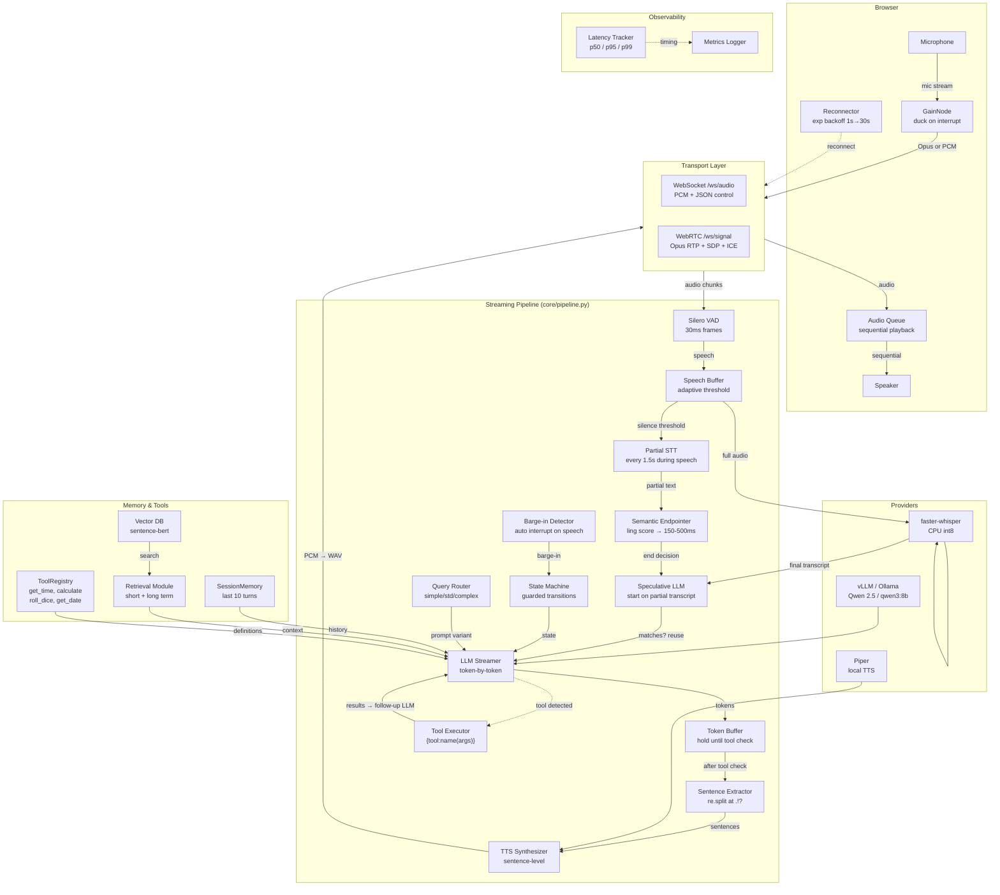
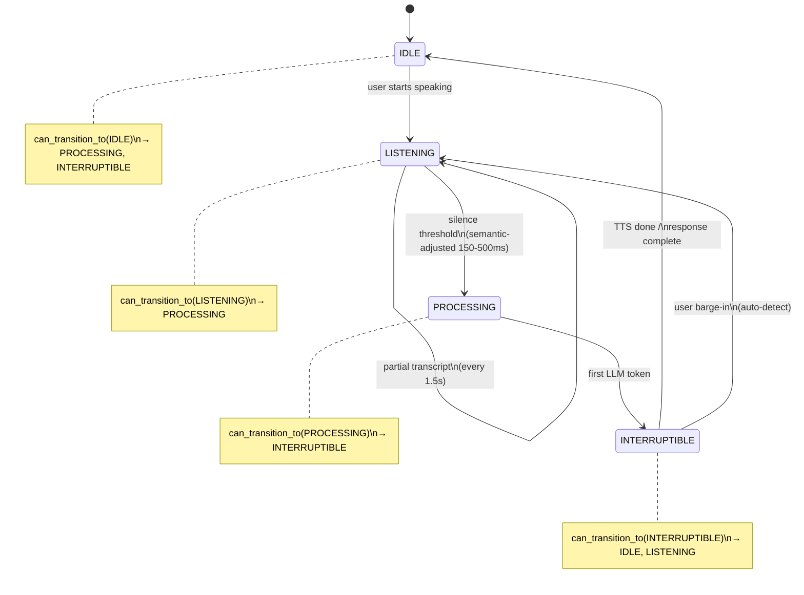
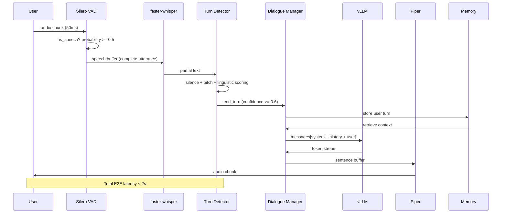

<div align="center">
  <br>
  <pre style="font-family: 'Fira Code', monospace; font-size: 1.4em; background: #0d1117; color: #58a6ff; padding: 1.5em 2em; border-radius: 12px; border: 1px solid #30363d; letter-spacing: 1px;">
╔══════════════════════════════════════════════════╗
║   ████████ ║  █████  ███████  █████              ║
║      ██    ║ ██   ██ ██      ██   ██             ║
║      ██    ║ ███████ ███████ ███████             ║
║      ██    ║ ██   ██      ██ ██   ██             ║
║      ██    ║ ██   ██ ███████ ██   ██             ║
╚══════════════════════════════════════════════════╝
  </pre>
  <h3 align="center" style="font-weight: 400; color: #8b949e;">
    Turn-Aware Speech Agent
  </h3>
  <p align="center" style="font-size: 1.1em; color: #c9d1d9; max-width: 600px;">
    A real-time Conversational AI Voice Agent that listens, understands, and responds<br>
    with human-like timing, awareness, and natural flow.
  </p>
  <br>
  <p>
    <a href="#architecture"><kbd>Architecture</kbd></a>
    <a href="#features"><kbd>Features</kbd></a>
    <a href="#stack"><kbd>Stack</kbd></a>
    <a href="#quick-start"><kbd>Quick Start</kbd></a>
    <a href="#pipeline"><kbd>Pipeline</kbd></a>
    <a href="#testing"><kbd>Testing</kbd></a>
  </p>
  <br>
</div>

---

## About TASA

TASA is not a command-response bot. It is a **conversational partner** that:

- **Listens** continuously via streaming speech-to-text
- **Thinks** with token-by-token LLM generation via vLLM
- **Speaks** with low-latency sentence-level TTS
- **Times** responses using silence + prosody + linguistic cues
- **Handles interruptions** -- barge-in when the user cuts in
- **Backchannels** naturally -- "uh-huh", "hmm", "right" at the right moment
- **Maintains dialogue state** -- knows when to listen, think, speak, or wait

---

<a name="architecture"></a>
## System Architecture



---

<a name="features"></a>
## Core Capabilities

### Real-Time Streaming Pipeline
| Stage | Latency Target | Mechanism |
|-------|----------------|-----------|
| Audio Ingestion | < 20ms | Opus 32kbps RTP (WebRTC) or PCM 256kbps (WebSocket) |
| VAD | < 30ms | Silero VAD -- per-frame speech probability |
| STT | < 500ms | faster-whisper base on CPU, partial transcripts every 1.5s |
| Semantic Endpointing | < 200ms | Linguistic score adjusts silence threshold 150-500ms |
| Speculative LLM | < 100ms TTFT | Starts LLM on partial transcript while STT finishes |
| LLM Streaming | < 100ms TTFT | vLLM/Ollama with token-by-token streaming |
| TTS Overlap | < 100ms/sentence | Sentence-level pipelining: TTS starts while LLM continues |
| Tool Calling | < 200ms | Detect {tool:name(args)}, execute, feed results back to LLM |

### Dialogue State Machine (Guarded HSM)


All transitions validated by `can_transition_to()` guards. Invalid transitions are logged as warnings.

### Latency Optimizations

| Optimization | Mechanism | Impact |
|-------------|-----------|--------|
| **Streaming STT** | Partial transcripts every 1.5s during speech | Real-time feedback |
| **Speculative LLM** | Start LLM on partial while STT finishes | -1-2s TTFT per turn |
| **Sentence Overlap** | TTS starts on first complete sentence | -2-3s first audio heard |
| **Semantic Endpointing** | Linguistic classifier adjusts threshold 150-500ms | -50-250ms endpoint accuracy |
| **WebRTC/Opus** | RTP audio with Opus codec at 32kbps | 10x less bandwidth, built-in AEC |
| **Query Routing** | Simple queries get ultra-brief prompts | -200-500ms for greetings/short queries |
| **Token Buffering** | Buffer until tool check, then emit | Prevents tool syntax from reaching UI |
| **Exponential Backoff** | 1s→30s with jitter on reconnect | Robust reconnection |

### Turn-Taking Intelligence
- **Silence threshold** -- adaptive: 150ms (questions) to 500ms (trailing conjunctions)
- **Prosody analysis** -- pitch trajectory (rising = question, falling = end)
- **Linguistic cues** -- filler words ("um", "uh"), trailing conjunctions ("and...", "but..."), question detection
- **Weighted fusion** -- 50% silence + 30% prosody + 20% linguistic to single confidence score

### Backchanneling
- Triggered on pauses **> 400ms** during user speech
- Context-aware selection -- acknowledging, agreeing, surprised, thinking, sympathetic
- Cooldown **3s** between backchannels to avoid sounding robotic
- Weighted candidate pool: `["uh-huh", "hmm", "right", "yeah", "i see", "okay"]`

### Memory System
| Type | Storage | Retrieval |
|------|---------|-----------|
| Short-term | Rolling window of last 10 turns | Sliding window context for LLM |
| Long-term | Sentence-BERT embeddings + cosine search | Top-k similar past conversations |
| Token budget | Auto-truncate to 4096 tokens | Promotes recent + relevant entries |

### Tool Calling
Built-in tools accessible via `{tool:name(args)}` syntax in LLM responses:

| Tool | Description | Example |
|------|-------------|---------|
| `get_time()` | Current time | `{tool:get_time()}` → `2:30 PM` |
| `get_date()` | Today's date | `{tool:get_date()}` → `Monday, July 26` |
| `calculate(expr)` | Math expression | `{tool:calculate(2+2)}` → `4` |
| `roll_dice(sides)` | Random dice roll | `{tool:roll_dice(6)}` → `4` |

Pipeline detects tool calls, executes them, feeds results back to LLM for a natural response.

---

<a name="stack"></a>
## Technology Stack

 | Component | Technology | Why |
|-----------|-----------|-----|
| **VAD** | [Silero VAD](https://github.com/snakers4/silero-vad) | Best accuracy-per-latency, per-frame inference |
| **STT** | [faster-whisper](https://github.com/SYSTRAN/faster-whisper) | CTranslate2 backend, 4x faster than OpenAI Whisper |
| **LLM** | [vLLM](https://github.com/vllm-project/vllm) / [Ollama](https://ollama.com) | Token streaming via OpenAI-compatible API or local Docker |
| **TTS** | [Piper](https://github.com/rhasspy/piper) | Sub-100ms per sentence, no GPU required, many voices |
| **Server** | FastAPI + Uvicorn | Async-native, WebSocket + WebRTC, high concurrency |
| **WebRTC** | [aiortc](https://github.com/aiortc/aiortc) | Opus RTP, STUN ICE, `TTSTrack` bridge to pipeline |
| **Memory** | sentence-transformers | all-MiniLM-L6-v2, 384-dim embeddings |
| **State Machine** | Custom `DialogueState` | Guarded transitions, `can_transition_to()` validation |
| **Infra** | Docker Compose | LLM (GPU) + TASA (CPU) as linked services |

---

<a name="quick-start"></a>
## Quick Start

### Local Development (Ollama — no GPU required)

```bash
# 1. Clone and create environment
python3 -m venv venv
source venv/bin/activate

# 2. Install TASA with all providers
pip install --editable ".[all]"

# 3. Start Ollama with a compatible model
ollama pull qwen3:8b

# Single-slot concurrency by default means rapid back-to-back questions while the
# assistant is still speaking will queue on Ollama. For concurrent generations,
# raise the per-model concurrency (systemd: set OLLAMA_NUM_PARALLEL in the unit):
#   Environment="OLLAMA_NUM_PARALLEL=2"
ollama serve &

# 4. Run TASA server
python3 -m app.cli server
```

### Docker (Full Stack, GPU)

```bash
# Start everything -- vLLM + TASA
docker compose up

# Services:
#   localhost:8000  -> TASA WebSocket server
#   localhost:8001  -> vLLM OpenAI-compatible API

# Configuration via .env:
#   TASA_LLM_MODEL, TASA_STT_MODEL, TASA_TTS_MODEL, etc.
```

### Local Mic Demo (WebSocket UI)

Open `http://localhost:8000/ui` in a browser and click **Start**.
Or for WebRTC: `http://localhost:8000/webrtc`.

---

<a name="pipeline"></a>
## End-to-End Data Flow



---

<a name="testing"></a>
## Testing

```bash
# Run all unit tests
pytest tests/ -v

# Expected output:
#   tests/test_memory.py .....
#   tests/test_state.py ......
#   tests/test_turn.py .........
#   20 passed in 0.15s
```

### Test Coverage

| Module | Tests | What's Covered |
|--------|-------|-----------------|
| `test_state.py` | 6 | Session state, turns, dialogue FSM with guarded transitions |
| `test_turn.py` | 9 | Turn detector, classifier (questions, fillers, prosody), interrupt handler |
| `test_memory.py` | 5 | Session memory, vector DB, retrieval module |

---

<a name="project-structure"></a>
## Project Structure

```
tasa/
├── app/                    # Entrypoints & API
│   ├── server.py           # FastAPI app with lifespan pipeline
│   ├── cli.py              # CLI: server / demo / metrics
│   ├── ui.html             # Full voice UI (WS transport)
│   ├── mic.html            # Minimal mic-only UI (WS transport)
│   ├── webrtc.html         # WebRTC client with RTCPeerConnection
│   └── routes/
│       ├── ws.py           # WebSocket /ws/audio: PCM streaming
│       ├── webrtc.py       # WebRTC /ws/signal: Opus RTP + ICE
│       └── health.py       # Health check endpoint
│
├── core/                   # Orchestration
│   ├── pipeline.py         # Async streaming pipeline (VAD→STT→LLM→TTS)
│   ├── state.py            # DialogueState FSM with can_transition_to() guards
│   ├── config.py           # Core configuration
│
├── providers/              # Plug-and-play model interfaces
│   ├── stt/
│   │   ├── base.py                     # Streaming STT ABC
│   │   └── faster_whisper_stt.py       # faster-whisper implementation
│   ├── llm/
│   │   ├── base.py                     # Streaming LLM ABC
│   │   └── vllm_llm.py                # OpenAI-compatible LLM client
│   └── tts/
│       ├── base.py                     # Streaming TTS ABC
│       └── piper_tts.py               # Piper TTS (Python API)
│
├── modules/                # AI & signal processing modules
│   ├── vad/
│   │   └── silero_vad.py              # Silero VAD wrapper
│   ├── turn/
│   │   ├── classifier.py  # Linguistic scoring engine
│   │   ├── interrupt.py   # Barge-in detection
│   │   └── timing.py      # Response timing heuristics
│   ├── dialogue/
│   │   ├── manager.py     # Conversation decision engine
│   │   ├── memory.py      # Dialogue memory
│   │   └── prompts.py     # build_system_prompt() with complexity tiers
│   ├── memory/
│   │   ├── session.py     # Session sliding window memory
│   │   ├── vector_db.py   # Sentence-BERT embedding store
│   │   └── retrieval.py   # Short + long term context fusion
│   ├── tools/
│   │   ├── registry.py    # ToolRegistry class
│   │   └── builtin.py     # get_time, get_date, calculate, roll_dice
│   ├── audio/
│   │   ├── input.py       # Audio input handler
│   │   ├── output.py      # Audio playback handler
│   │   └── processing.py  # Chunking, resampling
│   └── metrics/
│       ├── latency.py     # Per-stage p50/p95/p99 histograms
│       └── logger.py      # Structured event logging
│
├── tests/                  # Unit tests
│   ├── test_state.py
│   ├── test_turn.py
│   └── test_memory.py
│
├── utils/                  # Shared utilities
│   ├── timers.py
│   ├── audio.py
│   └── logger.py
│
├── configs/                # Runtime configuration
├── Dockerfile              # Multi-stage: builder + slim runtime
├── docker-compose.yml      # LLM (GPU) + TASA (CPU)
├── .env                    # Default environment variables
└── pyproject.toml          # Project metadata & dependencies
```

---

<a name="configuration"></a>
## Configuration

All via environment variables or `.env`:

| Variable | Default | Description |
|----------|---------|-------------|
| `TASA_STT_MODEL` | `base` | faster-whisper model size |
| `TASA_STT_DEVICE` | `cpu` | STT device (`cpu` or `cuda`) |
| `TASA_STT_COMPUTE` | `int8` | Compute type for CTranslate2 |
| `TASA_LLM_URL` | `http://localhost:11434/v1` | LLM API base URL (Ollama by default) |
| `TASA_LLM_MODEL` | `qwen3:8b` | LLM model name |
| `TASA_LLM_API_KEY` | `ollama` | API key for LLM provider |
| `TASA_TTS_MODEL` | `en_US-lessac-medium` | Piper voice model name |
| `TASA_TTS_SPEED` | `1.0` | TTS playback speed factor |
| `TASA_VAD_THRESHOLD` | `0.5` | VAD speech probability threshold |
| `TASA_VAD_MIN_SPEECH_MS` | `100` | Minimum speech duration (ms) |
| `TASA_VAD_MIN_SILENCE_MS` | `300` | Minimum silence for end-of-speech (ms) |
| `TASA_E2E_PIPELINE` | `true` | Enable end-to-end pipeline |
| `TASA_SPECULATIVE_LLM` | `true` | Enable speculative LLM execution |
| `TASA_SEMANTIC_ENDPOINTING` | `true` | Enable semantic endpointing |
| `TASA_INTERRUPT_ENABLED` | `true` | Enable barge-in detection |

---

<a name="api"></a>
## Transport: WebSocket

### Endpoint
`ws://localhost:8000/ws/audio`

### Client → Server (binary frames)
- 16kHz mono 16-bit PCM audio chunks (800 bytes = 50ms each)

### Server → Client (JSON text frames)

| Event | Fields | Description |
|-------|--------|-------------|
| `speech_start` | `{"type": "speech_start"}` | User starts speaking |
| `speech_end` | `{"type": "speech_end"}` | User stops speaking |
| `partial_transcript` | `{"type": "partial_transcript", "text": "..."}` | Mid-speech STT output (every ~1.5s) |
| `transcript` | `{"type": "transcript", "text": "..."}` | Final STT output |
| `llm_token` | `{"type": "llm_token", "token": "..."}` | One LLM token (non-tool tokens only) |
| `llm_done` | `{"type": "llm_done", "text": "..."}` | Complete LLM response |
| `tool_call` | `{"type": "tool_call", "name": "get_time", "args": [], "result": "2:30 PM"}` | Tool execution |
| `backchannel` | `{"type": "backchannel", "text": "..."}` | Listener acknowledgment |
| `interrupt` | `{"type": "interrupt"}` | Barge-in detected |
| `state` | `{"type": "state", "state": "LISTENING"}` | Dialogue state transition |

### Server → Client (binary frames)
- Raw 16-bit PCM audio chunks from TTS (22050Hz mono, 16-bit)

---

## Transport: WebRTC

### Endpoint
`ws://localhost:8000/ws/signal`

### Protocol
WebSocket-based signaling with JSON messages, then Opus RTP via `RTCPeerConnection`:

**Browser → Server (signaling JSON):**
| Message | Purpose |
|---------|---------|
| `{"type": "offer", "sdp": "..."}` | Client SDP offer |
| `{"type": "candidate", "candidate": "..."}` | ICE candidate |

**Server → Browser (signaling JSON):**
| Message | Purpose |
|---------|---------|
| `{"type": "answer", "sdp": "..."}` | Server SDP answer with Opus receive-only |
| `{"type": "candidate", "candidate": "..."}` | ICE candidate |

### Audio Flow
```
Browser mic → Opus (32kbps) → RTP → aiortc → pipeline → TTS → TTSTrack → Opus → RTP → Browser speaker
```

### Startup Flow
```
1. Browser creates RTCPeerConnection with STUN servers
2. Browser creates SDP offer (sendrecv)
3. Browser sends offer over WebSocket
4. Server creates answer with TTSTrack (Opus receive-only)
5. Browser receives answer, sets remote description
6. ICE candidates exchanged until connected
7. Browser mic stream flows into pipeline; TTS flows back as Opus RTP
```

### Client UI
- `/webrtc` — Full WebRTC client with RTCPeerConnection, mic capture, audio playback
- `/ui` — WebSocket (PCM) client with exponential backoff, audio queue, ducking
- `/mic` — Minimal WebSocket mic-only client

---

## Latency Budget (Stage-by-Stage)

```
Audio In → VAD:             < 30ms
VAD → Partial STT:          < 1.5s (first partial at 1.5s, then every 150ms)
Partial STT → Spec LLM:     < 50ms (speculative start on partial)
VAD → End-of-Speech:        adaptive 150-500ms (semantic-adjusted)
EOS → Final STT:            < 200ms
Final STT → LLM full input: < 50ms (reuse speculative output if matches)
LLM first token:            < 50ms (already streaming)
LLM token → Sentence TTS:   < 50ms (overlapped with LLM)
TTS → Speaker:              < 50ms
LLM last token → TTS done:  < 2s (overlapped with TTS)
---------------------------------------
Total E2E (first audio):    < 600ms typical (speculative + overlap)
Total E2E (full response):  < 1.5s
```

---

<div align="center">
  <br>
  <p style="color: #8b949e; font-size: 0.9em;">
    Built with ❤️ for natural, flowing conversation.
  </p>
  <br>
</div>
