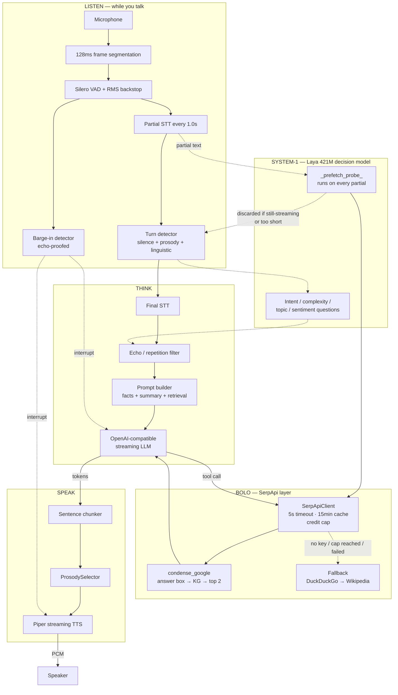

<div align="center">
<div style="width:100%; max-width:880px; margin:0 auto; border:1px solid #21262d; border-radius:18px; overflow:hidden; background:#0d1117;">
<div style="height:4px; background:#58a6ff;"></div>
<div style="padding:32px 28px 20px;">
<p style="font-size:44px; font-weight:700; color:#e6edf3; margin:0; letter-spacing:-1px;">Bolo</p>
<p style="font-size:13px; color:#8b949e; margin:6px 0 0; font-family:ui-monospace,SFMono-Regular,monospace;">बोलते ही सोचता है &middot; searches while you're still talking</p>
<p style="font-size:17px; color:#c9d1d9; margin:22px auto 0; max-width:640px; line-height:1.6;">A real-time voice agent that looks things up <b style="color:#79c0ff;">mid-sentence</b>. Powered by <a href="https://serpapi.com" style="color:#58a6ff;">SerpApi</a> for grounded answers, on a voice stack that hears you, waits for you, and can be interrupted.</p>
<p style="margin:26px auto 0; max-width:700px;">
<a href="#why" style="display:inline-block; margin:4px; padding:7px 16px; border:1px solid #30363d; border-radius:999px; background:#010409; color:#79c0ff; font-size:13px; text-decoration:none; font-family:ui-monospace,SFMono-Regular,monospace;">why</a>
<a href="#quick-start" style="display:inline-block; margin:4px; padding:7px 16px; border:1px solid #30363d; border-radius:999px; background:#010409; color:#79c0ff; font-size:13px; text-decoration:none; font-family:ui-monospace,SFMono-Regular,monospace;">quick-start</a>
<a href="#serpapi" style="display:inline-block; margin:4px; padding:7px 16px; border:1px solid #30363d; border-radius:999px; background:#010409; color:#79c0ff; font-size:13px; text-decoration:none; font-family:ui-monospace,SFMono-Regular,monospace;">serpapi</a>
<a href="#prefetch" style="display:inline-block; margin:4px; padding:7px 16px; border:1px solid #30363d; border-radius:999px; background:#010409; color:#79c0ff; font-size:13px; text-decoration:none; font-family:ui-monospace,SFMono-Regular,monospace;">prefetch</a>
<a href="#architecture" style="display:inline-block; margin:4px; padding:7px 16px; border:1px solid #30363d; border-radius:999px; background:#010409; color:#79c0ff; font-size:13px; text-decoration:none; font-family:ui-monospace,SFMono-Regular,monospace;">architecture</a>
<a href="#benchmark" style="display:inline-block; margin:4px; padding:7px 16px; border:1px solid #30363d; border-radius:999px; background:#010409; color:#79c0ff; font-size:13px; text-decoration:none; font-family:ui-monospace,SFMono-Regular,monospace;">benchmark</a>
<a href="#tools" style="display:inline-block; margin:4px; padding:7px 16px; border:1px solid #30363d; border-radius:999px; background:#010409; color:#79c0ff; font-size:13px; text-decoration:none; font-family:ui-monospace,SFMono-Regular,monospace;">tools</a>
<a href="#api" style="display:inline-block; margin:4px; padding:7px 16px; border:1px solid #30363d; border-radius:999px; background:#010409; color:#79c0ff; font-size:13px; text-decoration:none; font-family:ui-monospace,SFMono-Regular,monospace;">api</a>
</p>
<p style="margin:20px auto 0; max-width:700px; font-family:ui-monospace,SFMono-Regular,monospace; font-size:12px;">
<span style="display:inline-block; margin:3px; padding:4px 12px; border:1px solid #1f6feb; border-radius:6px; background:#0d1b33; color:#58a6ff;">VAD</span>
<span style="display:inline-block; margin:3px; padding:4px 12px; border:1px solid #1f6feb; border-radius:6px; background:#0d1b33; color:#58a6ff;">STT</span>
<span style="display:inline-block; margin:3px; padding:4px 12px; border:1px solid #1f6feb; border-radius:6px; background:#0d1b33; color:#58a6ff;">TURN</span>
<span style="display:inline-block; margin:3px; padding:4px 12px; border:1px solid #1f6feb; border-radius:6px; background:#0d1b33; color:#58a6ff;">LAYA</span>
<span style="display:inline-block; margin:3px; padding:4px 12px; border:1px solid #1f6feb; border-radius:6px; background:#0d1b33; color:#58a6ff;">SERPAPI</span>
<span style="display:inline-block; margin:3px; padding:4px 12px; border:1px solid #1f6feb; border-radius:6px; background:#0d1b33; color:#58a6ff;">LLM</span>
<span style="display:inline-block; margin:3px; padding:4px 12px; border:1px solid #1f6feb; border-radius:6px; background:#0d1b33; color:#58a6ff;">TTS</span>
<span style="display:inline-block; margin:3px; padding:4px 12px; border:1px solid #1f6feb; border-radius:6px; background:#0d1b33; color:#58a6ff;">MEMORY</span>
</p>
</div>
<div style="padding:14px 28px; background:#010409; border-top:1px solid #21262d; font-family:ui-monospace,SFMono-Regular,monospace; font-size:12px; color:#8b949e;"><span style="color:#58a6ff;">~820ms</span> speech-end to first audio &nbsp;&middot;&nbsp; <span style="color:#58a6ff;">469</span> tests passing &nbsp;&middot;&nbsp; <span style="color:#58a6ff;">74.5</span>/100 benchmark &nbsp;&middot;&nbsp; barge-in &amp; backchannel native &nbsp;&middot;&nbsp; track: <span style="color:#58a6ff;">AI Agents</span></div>
</div>
</div>

---

<a name="why"></a>
## Why Bolo

Ask a voice assistant a question it can't answer from memory and you get one of
two bad outcomes: a confident fabrication, or "let me look that up" followed by
four seconds of dead air while it searches.

Bolo is built around removing both.

**1. It searches while you're still talking.** Most agents wait for your final
transcript before doing anything. Bolo runs a 421M-parameter decision model
([Laya](https://github.com/convaiinnovations/laya)) on every *partial*
transcript, and if it can already tell which tool your sentence needs, it fires
that tool immediately — overlapping the network round trip with the rest of
your speech. By the time you finish the sentence, the answer is usually already
sitting in the prompt.

**2. Search results are condensed, not dumped.** A raw SerpApi Google response
is 30–40 KB of JSON. Bolo reduces it to one or two speakable sentences, taking
the answer box first, then the knowledge graph, then the top organic results —
each tagged with its source domain, so the model can say *where* a fact came
from instead of blurting it.

**3. It can't invent a place, a price, or a name.** The tool protocol carries
hard rules: never name a restaurant, shop, or business that didn't come out of a
`search_web` result, and never say "let me check". If the search returns nothing,
Bolo says so. The benchmark scores this as a **Grounding** category and Bolo
scores **9.0 / 10** on it.

**4. Search has a budget.** SerpApi's free tier is 250 searches a month. The
client counts every call against a hard cap, caches for 15 minutes so a
follow-up ("and tomorrow?") never re-pays for a query the prefetch already ran,
and falls back to keyless DuckDuckGo → Wikipedia when the cap is hit. You can
run the demo all day without burning the quota.

> **Say it out loud:** *"What's the weather in Goa?"* → it starts the search
> while you're still on "in Goa" → *"Twenty-nine degrees and humid, with
> evening showers expected. Want somewhere to eat nearby?"*

---

<a name="quick-start"></a>
## Quick start

### One command, no GPU

```bash
git clone https://github.com/Shindevrp/Bolo.git
cd Bolo

# Optional but recommended: give Bolo a SerpApi key (free tier, 250 searches/mo)
echo "SERPAPI_API_KEY=<your key from https://serpapi.com/manage-api-key>" >> .env

docker compose -f docker-compose.demo.yml up
```

That builds the image, starts Ollama, pulls `qwen2.5:3b`, and launches the app
and dashboard. Open:

| URL | What |
|-----|------|
| <http://localhost:8000/ui> | Voice UI (WebSocket) |
| <http://localhost:8000/webrtc> | Voice UI (WebRTC/Opus) |
| <http://localhost:8501> | Live dashboard (topic / intent / state) |

**With a GPU?** Add the override so the LLM runs on CUDA and Laya enables
(prefetch switches on — see [below](#prefetch)). Requires Docker +
[nvidia-container-toolkit](https://docs.nvidia.com/datacenter/cloud-native/container-toolkit/latest/install-guide.html):

```bash
docker compose -f docker-compose.demo.yml -f docker-compose.demo.gpu.yml up
```

Customize with `TASA_DEMO_LLM_MODEL` (default `qwen2.5:3b`; use `qwen2.5:1.5b`
on a weak machine) and `TASA_DEMO_STT_MODEL` (default `tiny`).

### Local, with your own LLM

Any OpenAI-compatible endpoint works — Ollama, vLLM, or a hosted API.

```bash
python3 -m venv .venv && source .venv/bin/activate
pip install --editable ".[all]"

ollama pull qwen3:8b && ollama serve &

export TASA_LLM_URL=http://localhost:11434/v1
export TASA_LLM_MODEL=qwen3:8b
export SERPAPI_API_KEY=<your key>        # optional; falls back to DDG/Wikipedia

python -m app.cli server --host 127.0.0.1 --port 8000
```

> Ollama serves one generation at a time by default, so a follow-up spoken over
> a still-speaking reply will queue. Raise concurrency with
> `OLLAMA_NUM_PARALLEL=2` in the systemd unit.

### Tests

```bash
./.venv/bin/python -m pytest        # 469 passed
```

Use `./.venv/bin/python -m pytest`, not bare `pytest` — the `laya` package lives
in the project venv, and 31 tests skip or fail without it.

---

<a name="serpapi"></a>
## How Bolo uses SerpApi

`providers/search/serpapi.py` is a single async client shared by every
search-backed tool. The raw SerpApi API is a fine HTTP client for a web page.
It is a poor fit for a voice turn, where a 4-second search is an audible gap, so
the client adds three things:

| Concern | What Bolo does | Why |
|---------|----------------|-----|
| **Latency** | Hard **5 s** timeout, `httpx.AsyncClient`, one client per process | A slow search must never stall a spoken turn. Past 5 s the tool reports failure and the fallback takes over. |
| **Cost** | **Credit counter** with a hard cap (`SERPAPI_CREDIT_CAP`, default **200**) | SerpApi's free tier is 250 searches/month. A runaway prefetch loop cannot burn the month's quota. |
| **Redundant work** | **15-minute in-memory TTL cache** keyed on `(engine, params)` | A prefetch that already ran, or a follow-up like *"and tomorrow?"*, costs no second credit. `client.cache_hits` counts them. |
| **Portability** | `SERPAPI_RECORD_DIR` writes every live response to a JSON fixture | Lets tests and benchmarks replay SerpApi payloads offline, so the 250-search budget is spent on demos, not on CI. |

```python
from providers.search import get_client

client = get_client()                  # built from the environment, singleton
if client.available:                   # has a key AND credits left
    data = await client.search("google", q="cheapest biryani in Hyderabad")
```

**Three engines, three tools:**

| Engine | Tool | Answers |
|--------|------|---------|
| `google` | `search_web` | General questions — answer box, knowledge graph, organic results |
| `google_maps` | `search_places` | Real venues — rating, review count, type, price, open state, address |
| `google_news` | `get_news` | Headlines, tagged with their outlet |

All three pass the India-first locale (`gl=in`, `hl=en`) via a shared
`locale_params()`.

Failures raise `SerpApiError` with text that starts `"Search failed:"` (or
`"Unable"` when the client is disabled). That prefix is not cosmetic:
`ToolRegistry._result_is_bad` already recognises it, so a failed search is
treated as *missing data* and retried or reported as unavailable — never read
aloud as if it were a fact.

### From 40 KB of JSON to one sentence

Each tool condenses its SerpApi response through a `condense_*` function before
the LLM ever sees it, and each prefers the most direct thing Google already
knows:

- **`condense_google`** — **answer box** (`answer` / `result` / `snippet`, plus
  the weather variant), then **knowledge graph** (`title (type): description`),
  then the **top 2 organic results** as `title (source.com): snippet`.
- **`condense_places`** — the **top 3** Maps listings as
  `Name, 4.5 stars (1,234 reviews), cafe, ₹200–400, Open, address`.
- **`condense_news`** — the **top 3** headlines as `Headline (The Hindu)`.

Joined with `" | "`, that is a string a 3B model can use directly. Without this
step the model has to sift 40 KB of JSON inside a token budget that is already
committed to the spoken reply — which is exactly how voice agents end up
parroting a URL or inventing a restaurant.

### Grounding, enforced in the prompt

`ToolRegistry.system_prompt_block()` gives the model the tool protocol and five
hard rules, including:

> NEVER name, recommend, or describe a specific place, restaurant, shop, or
> business that did not come from a `search_web` result. Fabricating a
> plausible-sounding name is prohibited.

> NEVER invent or improvise data when a tool result is missing.

Beneath that sits an upstream **entity gate**. Before the first LLM call,
[`EntityGate.query_needs_verification()`](modules/turn/entity.py) checks whether
you asked about a specific place, business, or named entity — *"restaurants near
Hyderabad"* trips it, *"what is the capital of France"* doesn't. When it trips,
the pipeline *injects a mandatory verification block* that routes you to
`search_places` when you're asking somewhere to eat, stay, shop or visit, and
`search_web` otherwise — and forbids the model from naming anything concrete
until a search result comes back. Asking about a place is therefore a two-step
round trip by construction, not a request the model can talk its way around.

If the pipeline exhausts its **3 tool rounds** and still has no data, it injects
*"do NOT invent data, do NOT call another tool"* and lets the model answer with
an honest "I couldn't find that".

### Falling back without a key

Bolo runs with no SerpApi key at all — the fallbacks are not decorative.

```
search_web   SerpApi Google  →  DuckDuckGo Instant Answers  →  Wikipedia
get_news     SerpApi Google News  →  BBC RSS (by category)
search_places  SerpApi Google Maps  →  nothing, by design
```

`search_places` **has no keyless fallback on purpose**: its docstring says
naming a place that didn't come from a real listing is exactly what the agent
must never do, so with no key it returns *"Unable to search places: SerpApi is
not available"* rather than inventing a plausible venue. `get_news` also
refuses to substitute generic RSS headlines for a specific topic — if you ask
about "Goa" and the search failed, it says so instead of handing you national
news as if it were Goa news.

The `search_web` fallbacks only run when there's no key, the credit cap is
reached, or the search failed. Both retry on 429/5xx with exponential backoff,
honour `Retry-After`, and run off the event loop so they can't block audio.

---

<a name="prefetch"></a>
## Searching while you're still talking

This is the part that makes Bolo a voice agent rather than a search box with a
microphone.

```
you:  "what are the      ← partial transcript, ~1s in
       cheapest flights
       from Delhi to     ← Laya: tool=search_web, confidence 0.5+  → FIRE
       Mumbai"           ← speech ends; prefetch is already back
        ↓
       result is injected as a system message *before* your turn
        ↓
       "Cheapest is IndiGo at four thousand two hundred, departing 6:40am."
```

`_prefetch_probe` (`core/pipeline.py`) fires on each fresh partial transcript
while you're still speaking. It is deliberately conservative:

| Guard | Behaviour |
|-------|-----------|
| **Confidence gate** | Reads Laya's `tool` answer at the normal 0.5 bar. `tool_needed` never reaches the stricter 0.9 bar used for routing flags — a wrong guess costs one lookup, not a wrong answer. |
| **Derivable args only** | `_prefetch_args` only prefetches tools whose arguments follow from the raw partial: `search_web`, `calculate` (regex-matched expression), `get_time`, `get_date`, `roll_dice`. Structured tools like `get_weather` and `set_reminder` return `None`, so a prefetch never invents a city. |
| **Still-relevant check** | A stashed result is only reused if the final transcript's word set *equals* the partial's word set, or the expression literally appears in what you said. Otherwise it's discarded. |
| **Generation tag** | The entry is stamped with the utterance's generation at fire time. If you start a new utterance, the stale result is dropped (but the cache is still cleared). |
| **Cancelled at speech-end** | The in-flight probe is cancelled so it can't hold the GPU through the reply. A worst-case miss costs exactly one wasted lookup. |
| **Minimum length** | Skipped under 3 words — "yes" or "no" is not a search. |

**Requires a GPU.** Laya is a 421M non-autoregressive model that runs a single
forward pass per probe. On CPU a turn-level pass takes seconds, which is past
the 2 s shadow timeout, so `providers/laya/client.py` disables itself and logs
`laya disabled: no GPU found (set TASA_LAYA_DEVICE=cpu to force)`. **In the
CPU-only Docker demo the prefetch is therefore inactive** — Bolo still searches,
it just waits for your final transcript. Run the GPU override to see the
mid-sentence search.

Turn it off with `TASA_TOOL_PREFETCH=0`. Note that a prefetch which falls back
to DuckDuckGo still makes a live keyless HTTP request — the credit cap governs
SerpApi, not the fallbacks.

---

<a name="architecture"></a>
## The voice engine

Bolo runs on **TASA**, a real-time speech-to-speech engine that already existed
before this project. TASA is not command-response: it streams audio, holds a
guarded dialogue state machine, backchannels, handles barge-in, and keeps
multi-tier memory. Bolo adds the search layer on top.

| Stage | Mechanism |
|-------|-----------|
| **Audio in** | WebSocket PCM 16 kHz or WebRTC Opus RTP, re-segmented into fixed 128 ms / 4096-byte frames |
| **VAD** | Silero per-frame speech probability + RMS energy backstop — frames under 0.003 RMS are silence even if the RNN says speech, so the VAD can't swallow the turn end |
| **Echo guard** | 350 ms grace after playback onset + mic-measured echo floor × 1.5, so you can talk over Bolo and it hears *you*, not itself |
| **Partial STT** | faster-whisper re-transcribes the accumulated buffer every 1.0 s — feeds the turn detector *and* the prefetch |
| **Turn detection** | Silence + prosody + linguistic cues fused into an end-of-turn decision |
| **Laya (System-1)** | 421M non-autoregressive decision model, typed `choice`/`score`/`noul` questions, never generates text so there's nothing to hallucinate |
| **Bolo search** | SerpApi Google → condensed to speakable text with sources; prefetch fires on partials |
| **LLM** | OpenAI-compatible streaming (vLLM / Ollama / hosted), started speculatively on the last partial |
| **TTS** | Piper, sentence-level overlap with the LLM stream, prosody selected per utterance from intent + sentiment |
| **Memory** | 20-turn window, rolling LLM summary, topic-keyed vector retrieval, durable user facts |



Depth lives in the code, not in this file: the guarded dialogue FSM in
[`core/state.py`](core/state.py), memory tiers in `modules/memory/`, prosody
selection in `modules/tts/prosody.py`, and the orchestration itself in
[`core/pipeline.py`](core/pipeline.py). An interactive runtime diagram is at
[`assets/tasa-architecture.html`](assets/tasa-architecture.html) — open it
directly in a browser, no server needed.

### Measured latency

`python -m bench.cli live` streams your mic and records each stage per turn
(faster-whisper `base` + Piper, p50 over a real session):

| Stage | p50 | range |
|-------|:---:|:---:|
| STT tail (speech-end → transcript) | ~150 ms | 130–190 ms |
| LLM first token | ~490 ms | 345–545 ms |
| **Perceived response (speech-end → first audio)** | **~820 ms** | 735–1435 ms |
| Full turn rtt (including TTS audio) | ~1535 ms | 1140–4630 ms |

A prefetched search removes the SerpApi round trip from the critical path
entirely — it overlaps with the tail of your speech.

---

<a name="tools"></a>
## Tools

The LLM emits a tool call inline; the pipeline **stops TTS immediately**, drains
the audio queue, runs the tools, appends the results, and streams a natural
follow-up reply.

```
{tool:search_web(cheapest flights from Delhi to Mumbai in October)}
{tool:search_places(query=best biryani, location=Hyderabad)}
{tool:get_news(Goa)}
```

Arguments may be **positional or `name=value`**. The parser is a
brace/quote-balancing scanner rather than a regex, so a JSON payload or a
parenthesised value inside an argument doesn't terminate the call early, and a
partially-streamed call is left alone until it closes.

| Tool | Source | Example |
|------|--------|---------|
| `search_web` | **SerpApi** `google` → DDG → Wikipedia | `{tool:search_web(Who is Nikola Tesla)}` |
| `search_places` | **SerpApi** `google_maps` (no fallback by design) | `{tool:search_places(query=biryani, location=Hyderabad)}` |
| `get_news` | **SerpApi** `google_news` → BBC RSS | `{tool:get_news(Goa)}` |
| `get_weather` | [wttr.in](https://wttr.in) (no key) | `{tool:get_weather(Hyderabad)}` |
| `get_time` | local clock | `{tool:get_time()}` |
| `get_date` | local date | `{tool:get_date()}` |
| `calculate` | AST-whitelist sandboxed evaluator | `{tool:calculate(2+2)}` |
| `roll_dice` | local RNG | `{tool:roll_dice(6)}` |
| `set_reminder` | local scheduler | `{tool:set_reminder(stand up in 20 minutes)}` |

`get_news` accepts either a topic ("Goa", "cricket") or one of the legacy
categories (`general`, `tech`, `science`, `business`), which map to fixed
queries and keep their RSS equivalents for the keyless path.

On a failed tool the registry retries once with 0.5 s backoff, then gives up
cleanly rather than looping — and the model is told never to chain a second
tool as its own fallback.

---

<a name="benchmark"></a>
## Benchmark

`bench/` is a speech-to-speech harness that drives the running agent over real
WebSocket audio, records a timed event transcript per scenario, and scores 12
weighted categories with an external judge. The canonical result is committed
as [`report.json`](report.json) (`label: full-fix-v2`).

```bash
python -m bench.cli run --agent tasa-ws --limit 3 \
  --judge-llm-url http://localhost:11434/v1 --judge-model qwen2.5:3b \
  --out report.json --label <name>
```

**74.5 / 100**, judge active, all 6 regression tests passing.

| Category | Score | Weight | Category | Score | Weight |
|----------|:-----:|:------:|----------|:-----:|:------:|
| Turn-taking | 10.0 | 10 | Grounding | 9.0 | 10 |
| Barge-in | 10.0 | 15 | Error recovery | 3.0 | 7 |
| ASR/Segmentation | 9.0 | 10 | TTS quality | 6.0 | 7 |
| Intent understanding | 9.0 | 8 | Latency | 6.0 | 5 |
| Context/State | 7.0 | 10 | Naturalness | 4.0 | 5 |
| Dialogue flow | 5.0 | 8 | Backchannel handling | 4.0 | 5 |
| | | | **Weighted total** | | **74.5 / 100** |

**Grounding (9.0)** is the category the Bolo search layer exists to protect —
HAL-001 feeds the agent *"restaurants near Hyderabad"* and asserts it produces no
fabricated entities.

### Regression tests

| ID | Scenario | Assertion | Result |
|----|----------|-----------|:------:|
| ASR-001 | `asr_wer` | LibriSpeech clip transcribes to ground truth | WER 11.8% ✅ |
| BI-001 | `barge_in` | *"Wait, no, that's not what I meant"* interrupts; TTS stops | INTERRUPT fired ✅ |
| BC-001 | `backchannel` | *"yeah uh-huh right"* does **not** trigger barge-in | no INTERRUPT ✅ |
| CTX-001 | `context` | Recommendation reflects corrected group size | "5" referenced ✅ |
| HAL-001 | `grounding` | *"restaurants near Hyderabad"* fabricates nothing | clean ✅ |
| REC-001 | `recovery` | Re-interprets a corrected request | acknowledged ✅ |

### Turn-taking, measured deterministically

Beyond the LLM judge, `bench/scoring/endpoint.py` reconstructs the turn-timing
timeline from the event transcript — hard numbers, no judge involved:

| Metric | Result | Reading |
|--------|:------:|---------|
| **False endpoint rate** | **0.0%** (0/12) | Never talks over you |
| **Missed endpoint rate** | 16.7% (2/12) | ~83% of turns answered inside the target window |
| **Endpoint P50 / P95** | 1.19 s / 2.71 s | Responsive at the 95th percentile |
| **Utterance fragment rate** | 0.0% (0/8) | Turns committed as clean wholes |
| **False barge-in rate** | **0.0%** (0/2) | Backchannels never cut the reply off |

> **Caveats, stated plainly.** The barge-in numerators are tiny (n=2, n=1), so
> treat those rows as indicative. The judge's scores come from `qwen2.5:3b` and
> a sub-category can fall back to a neutral 5 when the judge returns
> unparseable output. The 25% completion-capture rate in the full report is an
> ASR leading-word truncation artifact, not a turn-taking failure. And 2 of the
> 12 scenarios in `report.json` did not complete cleanly
> (`turn_taking`, `uncertainty`).

### What the search layer has *not* been measured on yet

Honest gap: there is **no SerpApi-vs-DuckDuckGo before/after benchmark in this
repo** — no fabricated-place rate delta, no prefetch hit rate, no
time-to-first-audio comparison. The Grounding score above is a TASA baseline
from before the SerpApi work landed. Don't take the search layer's benefit on
faith from this file; it needs its own A/B run.

---

<a name="testing"></a>
## Testing

```bash
./.venv/bin/python -m pytest        # 469 passed in ~46s
```

| Suite | Tests | Covers |
|-------|------:|--------|
| `tests/` | 409 (32 files) | pipeline, turn-taking, prosody, memory, entity grounding, backchannel vs barge-in, Laya phases 2–5, shadow store, fine-tune, live-latency |
| `tests/test_serpapi.py` | 36 | **the Bolo layer** — client timeout / cache / credit cap / error prefixes / fixture recording, `key=value` call parsing, and all three `condense_*` functions against replayed fixtures |
| `bench/tests/` | 60 (5 files) | harness reproducibility, scoring, latency recording |

The SerpApi tests **never touch the live API** — they replay
`tests/fixtures/serpapi/*.json` through `httpx.MockTransport`. Honest caveat:
those fixtures are currently **hand-written to SerpApi's documented response
shapes**, trimmed to the fields the tools read — not real recordings. Re-record
them against the live API with `SERPAPI_RECORD_DIR=tests/fixtures/serpapi` before
treating them as ground truth.

---

## Project structure

```
bolo/
├── app/          # FastAPI server, CLI, three HTML clients, session registry
├── core/         # pipeline.py (VAD→STT→Laya→SerpApi→LLM→TTS), state.py, config.py
├── providers/
│   ├── search/   # ← Bolo: async SerpApi client (timeout, cache, credit cap)
│   ├── laya/     # System-1 decision client + JSONL shadow-log store
│   └── llm/ stt/ tts/   # OpenAI-compatible LLM, faster-whisper, Piper
├── modules/
│   ├── tools/    # ← Bolo: ToolRegistry (kwargs + call scanner), builtin,
│   │             #   web_search.py, local.py (Maps), news.py
│   ├── laya/     # Typed question schemas (turn / cadence-1 / prefetch)
│   └── turn/ backchannel/ prosody/ emotion/ memory/ dialogue/ tts/ metrics/ vad/
├── bench/        # Speech-to-speech harness: scenarios, judge, endpointing, Laya eval
├── tests/        # 409 unit tests (incl. 36 SerpApi fixture-replay tests)
│   └── fixtures/serpapi/   # Recorded SerpApi payloads for offline replay
├── assets/       # cover + interactive architecture diagram
├── report.json   # Canonical benchmark (74.5 / 100)
└── Dockerfile, docker-compose.demo.yml (+ .gpu.yml override), pyproject.toml
```

---

## Configuration

`.env` is gitignored; see [`.env.example`](.env.example) for the annotated list.

### SerpApi

| Variable | Default | Description |
|----------|---------|-------------|
| `SERPAPI_API_KEY` | *(empty)* | Key from [serpapi.com](https://serpapi.com/manage-api-key). Empty ⇒ `search_web` falls back to DDG → Wikipedia. |
| `SERPAPI_CREDIT_CAP` | `200` | Hard ceiling on searches per process. |
| `SERPAPI_GL` | `in` | Google country locale — India-first. |
| `SERPAPI_HL` | `en` | Google interface language. |
| `SERPAPI_RECORD_DIR` | *(unset)* | Write every live response as a JSON fixture for offline replay. |

### Laya / prefetch

| Variable | Default | Description |
|----------|---------|-------------|
| `TASA_LAYA_ENABLED` | `1` | Master switch for the System-1 layer |
| `TASA_LAYA_DEVICE` | *(auto)* | Empty/auto ⇒ CUDA if present, else CPU. **On CPU the client disables itself** — a turn-level pass exceeds the 2 s shadow timeout. |
| `TASA_LAYA_CONF_THRESHOLD` | `0.5` | Confidence bar for `choice` answers (the prefetch gate) |
| `TASA_TOOL_PREFETCH` | `1` | Mid-sentence search. `0` disables only the prefetch probe. |
| `TASA_LAYA_PHASE2`…`PHASE5` | `0` | Enforcement tiers — fail-closed, off by default, telemetry always records |
| `TASA_LAYA_SHADOW_LOG` | `~/.tasa/shadow/rows.jsonl` | Laya-vs-legacy rows for fine-tuning export |

### Models

| Variable | Default | Description |
|----------|---------|-------------|
| `TASA_LLM_URL` | `http://localhost:8000/v1` | OpenAI-compatible base URL (vLLM / Ollama / hosted) |
| `TASA_LLM_MODEL` | `Qwen/Qwen2.5-7B-Instruct-AWQ` | Model name |
| `TASA_LLM_API_KEY` | `EMPTY` | LLM API key |
| `TASA_LLM_FALLBACK_URL` | *(empty)* | Escalation tier; empty disables it |
| `TASA_STT_MODEL` / `_DEVICE` / `_COMPUTE` | `base` / `cpu` / `int8` | faster-whisper size and CTranslate2 device/type |
| `TASA_TTS_MODEL` | `/usr/share/piper/voices/en_US-lessac-medium.onnx` | Piper voice path |
| `TASA_VAD_THRESHOLD` / `_DEVICE` | `0.5` / `auto` | Silero speech threshold and device |
| `TASA_EMOTION_ENABLED` / `_MODEL` | `1` / `emotion-english-distilroberta-base` | Emotion classifier |
| `TASA_LOG_LEVEL` | `INFO` | `DEBUG` enables pipeline traces |

---

<a name="api"></a>
## HTTP API

| Endpoint | Method | Description |
|----------|--------|-------------|
| `/health`, `/health/ready`, `/health/live` | GET | Health, readiness (503 until the pipeline is up), liveness |
| `/metrics` | GET | Uptime + per-stage latency p50/p95/p99 |
| `/sessions` | GET | Live session snapshots (state, topic, intent, engagement) |
| `/chat/` | POST | One-shot completion `{"message": "..."}` |
| `/chat/stream` | POST | SSE token stream |
| `/ui`, `/mic`, `/webrtc` | GET | Client HTML |

### WebSocket — `ws://localhost:8000/ws/audio`

Client → server: 16 kHz mono 16-bit PCM binary frames; JSON `{"type":"ping"}`
and `{"type":"interrupt"}`.

Server → client JSON events: `speech_start`, `speech_end`,
`partial_transcript` (~every 1.0 s), `transcript`, `llm_token`, `llm_done`,
`tts_done`, `backchannel`, `interrupt`, `status`, `error`; plus binary PCM audio
frames.

### WebRTC — `ws://localhost:8000/ws/signal`

SDP/ICE signaling over WebSocket, then Opus RTP via `aiortc`. Incoming RTP is
resampled to 16 kHz mono; outgoing TTS WAV is header-stripped into a `TTSTrack`.

---

## Disclosure

**Existing project — yes.** The voice engine (VAD → STT → turn detection → LLM
→ TTS, barge-in, backchannel, memory, Laya System-1) is **TASA**, built before
this hackathon. Bolo is the SerpApi search layer added on top of it, plus the
mid-sentence prefetch. Roughly the first two items of the plan are implemented:
the SerpApi client, the three search tools (`search_web`, `search_places`,
`get_news`), and `key=value` tool arguments. Flights and hotels tools are **not**
built yet, the prefetch path has no dedicated test coverage, and there is no
SerpApi-vs-fallback A/B benchmark (see the honest gap noted above).

**AI tools used.** Built with AI assistance (Claude) for code generation,
refactoring, and documentation. Benchmark scoring uses an LLM judge
(`qwen2.5:3b` by default) — a real limitation of the 74.5 number, which is why
the deterministic endpointing table above is the more trustworthy artefact.

**Credits.** SerpApi's free tier is 250 searches/month; Bolo's credit cap
defaults to 200 per process so a demo session cannot exhaust it. Recorded
fixtures (`SERPAPI_RECORD_DIR`) keep tests and benchmarks off the live API.

**Track:** AI Agents.

---

## Open to work

Hey 👋 — Bolo is a real, working voice agent (search mid-sentence, grounded in
live SerpApi results, barge-in and backchannel native, 469 tests green), and I
built it to prove out exactly the skills I want to bring to a team.

**Open to opportunities: AI research / AI-ML roles and PhD positions.**

**What I bring:** real-time voice and streaming pipelines, fast-prototyping
speech-to-speech agents, and clean reasoning about latency, turn-taking, credit
budgets, and edge cases.

**Looking for:** AI research / AI-ML roles and PhD positions — voice AI,
real-time ML, and AI infrastructure.

📫 **Let's talk** — [shindevinayakraopatil@gmail.com](mailto:shindevinayakraopatil@gmail.com) · [LinkedIn](https://www.linkedin.com/in/shindeaidevloper/) · [Resume](https://drive.google.com/file/d/1v6gg3-u8gvPU0vUjdjQZIM3x5kITP_aN/view?usp=drive_link)

---

<div align="center">
<br>
<p style="color: #8b949e; font-size: 0.9em;">
  Searches while you're still talking.
</p>
<br>
</div>
