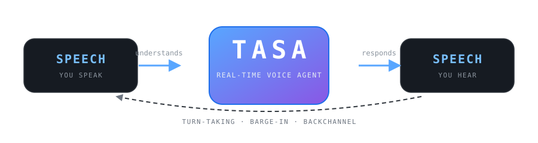
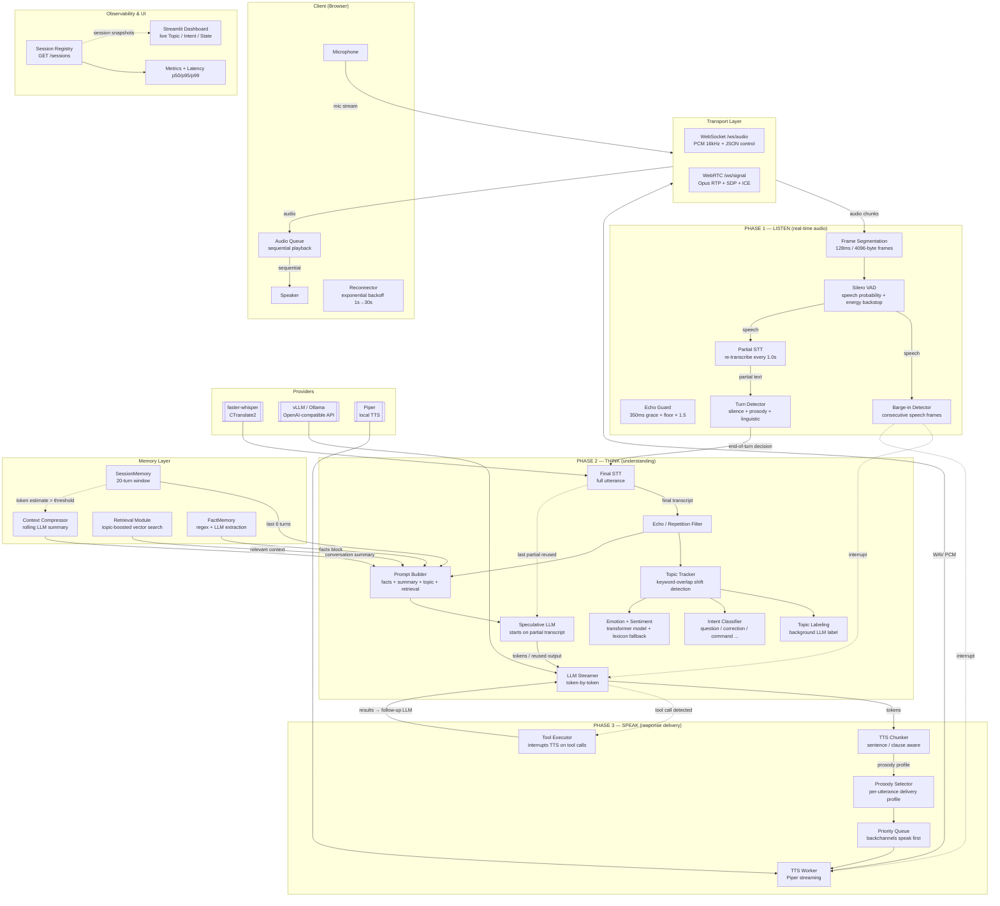
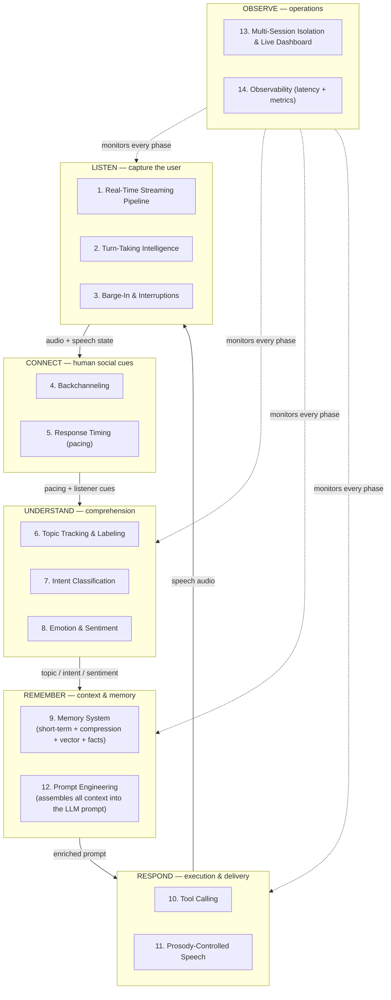
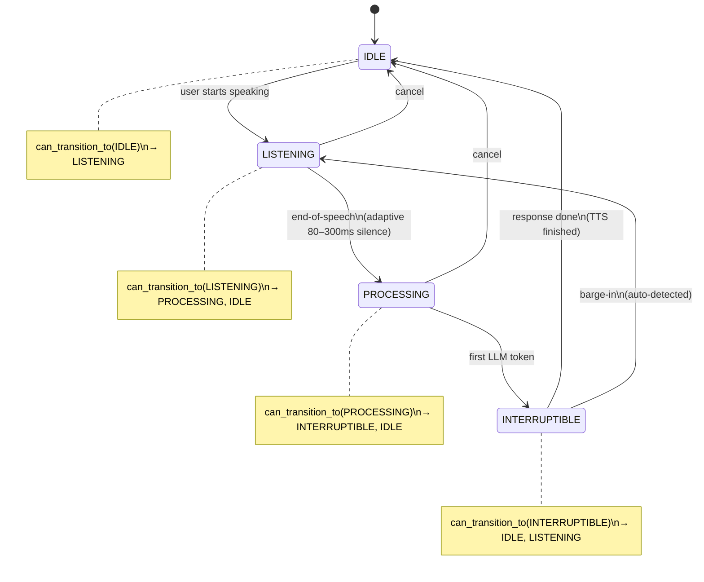
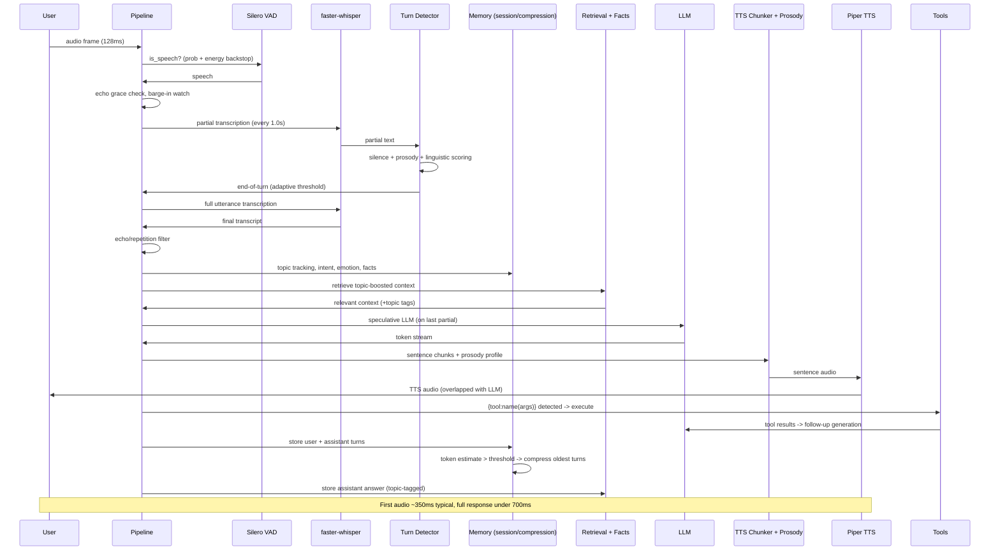

<div align="center">
<div style="width:100%; max-width:880px; margin:0 auto; border:1px solid #21262d; border-radius:18px; overflow:hidden; background:#0d1117;">
<div style="height:4px; background:#58a6ff;"></div>
<div style="padding:32px 28px 20px;">

<p style="font-size:17px; color:#c9d1d9; margin:22px auto 0; max-width:620px; line-height:1.6;">A real-time conversational AI voice agent that <b style="color:#79c0ff;">listens</b>, <b style="color:#79c0ff;">understands</b>, and <b style="color:#79c0ff;">responds</b> with human-like timing, awareness, and natural flow.</p>
<p style="margin:26px auto 0; max-width:700px;">
<a href="#architecture" style="display:inline-block; margin:4px; padding:7px 16px; border:1px solid #30363d; border-radius:999px; background:#010409; color:#79c0ff; font-size:13px; text-decoration:none; font-family:ui-monospace,SFMono-Regular,monospace;">architecture</a>
<a href="#features" style="display:inline-block; margin:4px; padding:7px 16px; border:1px solid #30363d; border-radius:999px; background:#010409; color:#79c0ff; font-size:13px; text-decoration:none; font-family:ui-monospace,SFMono-Regular,monospace;">features</a>
<a href="#state-machine" style="display:inline-block; margin:4px; padding:7px 16px; border:1px solid #30363d; border-radius:999px; background:#010409; color:#79c0ff; font-size:13px; text-decoration:none; font-family:ui-monospace,SFMono-Regular,monospace;">state-machine</a>
<a href="#stack" style="display:inline-block; margin:4px; padding:7px 16px; border:1px solid #30363d; border-radius:999px; background:#010409; color:#79c0ff; font-size:13px; text-decoration:none; font-family:ui-monospace,SFMono-Regular,monospace;">stack</a>
<a href="#quick-start" style="display:inline-block; margin:4px; padding:7px 16px; border:1px solid #30363d; border-radius:999px; background:#010409; color:#79c0ff; font-size:13px; text-decoration:none; font-family:ui-monospace,SFMono-Regular,monospace;">quick-start</a>
<a href="#pipeline" style="display:inline-block; margin:4px; padding:7px 16px; border:1px solid #30363d; border-radius:999px; background:#010409; color:#79c0ff; font-size:13px; text-decoration:none; font-family:ui-monospace,SFMono-Regular,monospace;">data-flow</a>
<a href="#testing" style="display:inline-block; margin:4px; padding:7px 16px; border:1px solid #30363d; border-radius:999px; background:#010409; color:#79c0ff; font-size:13px; text-decoration:none; font-family:ui-monospace,SFMono-Regular,monospace;">testing</a>
<a href="#benchmark" style="display:inline-block; margin:4px; padding:7px 16px; border:1px solid #30363d; border-radius:999px; background:#010409; color:#79c0ff; font-size:13px; text-decoration:none; font-family:ui-monospace,SFMono-Regular,monospace;">benchmark</a>
<a href="#api" style="display:inline-block; margin:4px; padding:7px 16px; border:1px solid #30363d; border-radius:999px; background:#010409; color:#79c0ff; font-size:13px; text-decoration:none; font-family:ui-monospace,SFMono-Regular,monospace;">api</a>
</p>
<p style="margin:20px auto 0; max-width:700px; font-family:'Fira Code',ui-monospace,monospace; font-size:12px;">
<span style="display:inline-block; margin:3px; padding:4px 12px; border:1px solid #1f6feb; border-radius:6px; background:#0d1b33; color:#58a6ff;">VAD</span>
<span style="display:inline-block; margin:3px; padding:4px 12px; border:1px solid #1f6feb; border-radius:6px; background:#0d1b33; color:#58a6ff;">STT</span>
<span style="display:inline-block; margin:3px; padding:4px 12px; border:1px solid #1f6feb; border-radius:6px; background:#0d1b33; color:#58a6ff;">TURN</span>
<span style="display:inline-block; margin:3px; padding:4px 12px; border:1px solid #1f6feb; border-radius:6px; background:#0d1b33; color:#58a6ff;">INTENT</span>
<span style="display:inline-block; margin:3px; padding:4px 12px; border:1px solid #1f6feb; border-radius:6px; background:#0d1b33; color:#58a6ff;">EMOTION</span>
<span style="display:inline-block; margin:3px; padding:4px 12px; border:1px solid #1f6feb; border-radius:6px; background:#0d1b33; color:#58a6ff;">LLM</span>
<span style="display:inline-block; margin:3px; padding:4px 12px; border:1px solid #1f6feb; border-radius:6px; background:#0d1b33; color:#58a6ff;">TTS</span>
<span style="display:inline-block; margin:3px; padding:4px 12px; border:1px solid #1f6feb; border-radius:6px; background:#0d1b33; color:#58a6ff;">MEMORY</span>
<span style="display:inline-block; margin:3px; padding:4px 12px; border:1px solid #1f6feb; border-radius:6px; background:#0d1b33; color:#58a6ff;">TOOLS</span>
</p>
</div>
<div style="padding:14px 28px; background:#010409; border-top:1px solid #21262d; font-family:'Fira Code',ui-monospace,monospace; font-size:12px; color:#8b949e;"><span style="color:#58a6ff;">~350ms</span> first audio &nbsp;&middot;&nbsp; <span style="color:#58a6ff;">&lt;0.9s</span> voice-turn response &nbsp;&middot;&nbsp; <span style="color:#58a6ff;">372</span> tests passing &nbsp;&middot;&nbsp; <span style="color:#58a6ff;">74.5</span> benchmark &nbsp;&middot;&nbsp; barge-in &amp; backchannel native &nbsp;&middot;&nbsp; self-labelling Laya System-1</div>
</div>
</div>

---

## About TASA

TASA is not a command-response bot. It is a **conversational partner** that:

- **Listens** continuously via streaming speech-to-text (frame-segmented VAD → partial transcripts)
- **Understands** not just the words, but the *topic*, *intent*, *emotion*, and *engagement* of the speaker
- **Thinks** with token-by-token LLM generation via vLLM / Ollama, started speculatively before STT finishes
- **Speaks** with low-latency sentence-level TTS that adapts *prosody* (speed, tone, emphasis) to the conversation
- **Times** responses using silence + prosody + linguistic cues and a human pacing engine
- **Handles interruptions** — barge-in when the user cuts in, with echo-proofing
- **Backchannels** naturally — "uh-huh", "hmm", "right" at the right moment, plus thinking fillers
- **Remembers** — short-term window, rolling LLM-compressed summaries, topic-keyed long-term vector memory, and durable user facts
- **Maintains dialogue state** — knows when to listen, think, speak, or wait (guarded state machine)

---

<a name="architecture"></a>
## System Architecture

> **Interactive runtime diagram:** open [`assets/tasa-architecture.html`](assets/tasa-architecture.html)
> for a self-contained, interactive architecture view (pan/zoom, focus, theme,
> relationship tracing) of the high-level runtime — the same Listen → Think →
> Speak pipeline shown below. From a terminal, just run:
>
> ```bash
> xdg-open assets/tasa-architecture.html   # Linux
> open assets/tasa-architecture.html       # macOS
> ```
>
> The file is fully self-contained (no server required) — you can also open it
> directly in any browser or double-click it in your file manager.



---

<a name="features"></a>
## Core Capabilities (in detail)

### Capabilities Overview



### 1. Real-Time Streaming Pipeline

| Stage | Mechanism | Notes |
|-------|-----------|-------|
| Audio Ingestion | WebSocket PCM (16kHz) or WebRTC Opus RTP | Frame-segmented into uniform 128ms / 4096-byte windows |
| Voice Activity Detection | Silero VAD per-frame probability + RMS energy backstop | Frames below `0.003` RMS are treated as silence even if the VAD RNN says speech — prevents the VAD state from swallowing the turn end |
| Echo Proofing | 350ms grace period after playback onset + acoustic mic-measured echo floor × 1.5 | Lets the speaker's own TTS overlap; any signal above the floor during the next turn is treated as the user (barge-in) |
| Partial STT | Re-transcribes the accumulated speech buffer every 1.0s | Feeds the turn detector and the speculative LLM |
| Final STT | faster-whisper on the full utterance | `beam_size=1, best_of=1, vad_filter=False` for low latency |
| Speculative LLM | Starts LLM generation on the last partial transcript while STT finishes | Output reused when the final transcript starts with the partial and intent ≠ correction → saves ~1–2s TTFT |
| Sentence TTS | Piper, sentence-level overlap with the LLM stream | `TTSChunker` splits at sentence → clause → hard cap; backchannels get priority in the queue |

### 2. Turn-Taking Intelligence

Turn detection fuses three signals in the `TurnDetector` / `TurnClassifier`:

- **Silence** (50% weight) — adaptive silence threshold that tightens based on what was said
- **Prosody** (30% weight) — pitch trajectory from the `ProsodyAnalyzer` (rising = question, falling = turn end)
- **Linguistic cues** (20% weight) — filler words, trailing conjunctions ("and...", "but..."), question words, sentence punctuation

The adaptive end-of-speech threshold is set per turn:

| Condition | Silence threshold |
|-----------|-------------------|
| Strong question signal (score ≥ 0.8) | 80ms |
| Moderate question signal (score ≥ 0.6) | 120ms |
| `end_turn_force` | 100ms |
| `end_turn` | 180ms |
| Trailing conjunction / open-ended (score ≤ 0.2) | 300ms |
| High engagement (longer, invested turns) | 200ms |
| Default | 250ms |

### 3. Barge-In & Interruptions

The `InterruptHandler` tracks consecutive speech frames during playback. When the user cuts in:

- **During playback**: threshold is raised to `max(energy_threshold, echo_floor × 1.5)` and interrupts after `playback_consecutive_speech_frames` (1) frame — the user's speech cuts off TTS playback within a single 128ms VAD frame. The `echo_floor` is measured **acoustically** from non-speech microphone frames while the assistant is playing (not the electrical TTS waveform), so the raised threshold rides just above the echo actually reaching the mic while remaining reachable by normal user speech.
- **During LLM generation** (INTERRUPTIBLE state): lower threshold, `consecutive_speech_frames` (3) frames

An interrupt cancels the current LLM task and TTS worker immediately, bumps the session's output **generation** so any stale audio chunks still in flight are dropped by the client pumps (WebSocket/WebRTC), clears playback state, and returns to `LISTENING`. The browser stops the currently playing `BufferSource` and wipes its queued audio on the `interrupt` message.

### 4. Backchanneling

Two kinds of natural listener behavior:

- **Active listening backchannels** — emitted on pauses > 400ms during user speech (after ≥ 2s of speech, with a 3s cooldown and an engagement gate). Context-aware selection:
  - `acknowledging`: "uh-huh", "hmm", "right", "yeah", "okay", "i see"
  - `agreeing`: "yeah", "right", "exactly", "totally", "for sure"
  - `surprised`: "oh", "wow", "really", "no way", "huh"
  - `sympathetic`: "mm-hmm", "i hear you", "right", "yeah"
- **Thinking fillers** — if the LLM hasn't produced a first token within 0.5s, a filler ("hmm...", "let me think", "so") is queued at the **highest priority** (before normal response chunks) so the silence doesn't feel dead

### 5. Response Timing (human pacing)

`TurnTiming.compute_delay` produces a human-like response delay (50–600ms):

- Engaged users get faster responses (`engagement_factor`)
- Questions get a 0.7× delay multiplier
- Short turns (< 1s) → faster; long turns (> 5s) → slower
- Rapid-fire exchange (2+ turns within 2s) → 0.8× delay

The delay is emitted as a `status` event (e.g. `waiting 0.3s`) before the response is generated.

### 6. Topic Tracking & Labeling

`TopicTracker` maintains the current topic deterministically from keyword overlap:

- Each turn is reduced to its top-3 content keywords (stopwords/filtered)
- If overlap with the current topic falls below `shift_threshold` (0.2), a **topic shift** is declared and a new topic segment opens
- When a topic is stable, a **background LLM call** attaches a short human-friendly label (1–4 words) — pure upgrade, the deterministic signal never depends on it
- The topic is injected into the system prompt (`Current topic: ...`), drives **topic-boosted retrieval**, tags long-term memories, and is surfaced in the live dashboard

### 7. Intent Classification

Deterministic, offline intent detection (`IntentClassifier`, lexicon-first, zero latency), ordered by signal strength:

| Intent | Trigger | Prompt effect |
|--------|---------|---------------|
| `question` | ends with `?` or starts with a question word | — |
| `correction` | "not that", "i meant", "that's wrong", "scratch that"... | "Acknowledge the correction briefly, respond directly, don't repeat" |
| `farewell` | "bye", "goodbye", "see you"... | — |
| `greeting` | "hi", "hello", "hey"... | — |
| `backchannel` | "okay", "uh-huh", "right", "thanks"... | — |
| `command` | starts with an imperative verb or contains `{tool:...}` | snappier, more direct delivery |
| `continuation` | starts with "and/also/but/then..." or ends with a reference pronoun | "Respond fluidly without re-introducing the topic" |
| `statement` | everything else | — |

### 8. Emotion & Sentiment

`EmotionClassifier` runs a HuggingFace transformer (`j-hartmann/emotion-english-distilroberta-base`) on the user's transcript (0.5s cap), mapping emotion labels (joy, anger, fear, gratitude...) to a sentiment bucket (`positive` / `negative` / `neutral`). It loads lazily off the hot path, runs in a background thread with a 0.5s cap (the lexicon result wins on timeout/error), and the speculative LLM keeps generating while it runs.

### 9. Memory System

| Layer | Storage | Behavior |
|-------|---------|----------|
| **Short-term** | `SessionMemory` — 20-turn deque | Last 6 turns injected verbatim; auto-truncated to a 3072-token budget if over |
| **Context Compression** | LLM rolling summary (≤ 800 chars) | When `token_estimate() > 1500`, the oldest 8 entries are folded into the summary in the background; the summary is injected as a system message so nothing important is lost as history grows |
| **Long-term (topic-keyed)** | Sentence-BERT (`all-MiniLM-L6-v2`) vector store + metadata | Every assistant answer is stored with its topic; retrieval boosts same-topic docs (+0.08) and dedupes against recent turns |
| **Facts** | `FactMemory` (≤ 24 facts) | Durable personal facts ("my name is X", "i live in X", pets, diet, family...) extracted by high-precision regex rules instantly + an optional background LLM pass (rate-limited 30s, skips questions, 8s timeout). Latest statement wins, so the user can correct earlier claims. Injected as a `Facts about the user:` block |

### 10. Tool Calling

The LLM emits `{tool:name(args)}` inline. The pipeline detects the marker, **stops TTS immediately**, drains the queue, executes all tools in parallel, appends results as `tool` role messages, and streams a natural follow-up response.

| Tool | Example |
|------|---------|
| `get_time()` | → `2:30 PM` |
| `get_date()` | → `Saturday, August 01, 2026` |
| `calculate(2+2)` | safe-eval math → `4` |
| `roll_dice(6)` | random → `4` |
| `echo(text)` | → text |

### 11. Prosody-Controlled Speech

`ProsodySelector` maps live conversation state to per-utterance Piper synthesis parameters (`length_scale` = speed, `noise_scale` = expressiveness, `sentence_silence` = pause weight):

- **Intent**: corrections are slow/soft (`measured`), commands snappy (`direct`), continuations keep momentum (`flow`)
- **Sentiment**: negative → supportive (slower), positive → warm (brighter)
- **Repetition**: user repeated themselves → patient, measured
- **Question** endings → slower with a longer pause; **ALL-CAPS** words are emphasized (slower + louder); numbered lists get even pacing; ellipses become thoughtful pauses
- **Topic shift** at the start of a reply → deliberate intro delivery
- First response of a session → an "opening" delivery

Comma-based pauses are spliced into synthesized audio, and markdown is stripped (`sanitize_for_tts`) so the model's formatting never reaches the speaker.

### 12. Prompt Engineering

`build_system_prompt` assembles the persona from engagement and query complexity:

- **Query routing**: greetings/short → `simple` (ultra-brief), coding/deep questions → `complex` (structured depth), else `standard`
- **Engagement tiers**: disengaged (< 0.3) → brief + no question-sprinkling; engaged (> 0.7) → more expressive and detailed
- **Human-like behaviors**: sentence variety, soft transitions, thinking pauses, ALL-CAPS stress (one word per sentence), chunked explanations
- **Anti-repetition hygiene**: never end every reply with a question, never reuse closing lines/phrases, no re-greeting mid-conversation
- Context-aware extras: `Ongoing conversation` after turn 3, retrieved context, facts, current topic, compressed summary, correction/continuation guidance, and the tool-call contract

### 13. Multi-Session Isolation & Live Dashboard

- Each WebSocket/WebRTC connection gets a unique `session_id` and its own `SessionMemory`, `RetrievalModule`, `FactMemory`, `TopicTracker`, `InterruptHandler`, and `ConversationContext`
- A `SessionRegistry` keeps live snapshots (state, topic, intent, engagement, turn counts) served at `GET /sessions`
- A **Streamlit dashboard** (`streamlit_app.py`) auto-refreshes every 2s showing the latest session's Topic / Intent / State / Engagement / turn counts, with the full voice UI embedded

### 14. Observability

- `LatencyTracker` — per-stage p50/p95/p99 histograms (STT, LLM first token, LLM full)
- `MetricsLogger` — structured event logging
- `GET /metrics` — uptime + latency report
- Server warm-up at startup: LLM (first generation), emotion classifier, and the retrieval encoder are all pre-loaded so first-turn latency is not paid on the audio hot path

---

<a name="state-machine"></a>
## Dialogue State Machine (Guarded HSM)



All transitions pass through `can_transition_to()` guards; illegal transitions are logged and dropped.

---

<a name="stack"></a>
## Technology Stack

| Component | Technology | Why |
|-----------|-----------|-----|
| **VAD** | [Silero VAD](https://github.com/snakers4/silero-vad) | Best accuracy-per-latency, per-frame inference |
| **STT** | [faster-whisper](https://github.com/SYSTRAN/faster-whisper) | CTranslate2 backend, 4× faster than OpenAI Whisper |
| **LLM** | [vLLM](https://github.com/vllm-project/vllm) / [Ollama](https://ollama.com) | Token streaming via OpenAI-compatible API |
| **TTS** | [Piper](https://github.com/rhasspy/piper) | Sub-100ms per sentence, local, prosody-tunable synthesis |
| **Server** | FastAPI + Uvicorn | Async-native, WebSocket + WebRTC, high concurrency |
| **WebRTC** | [aiortc](https://github.com/aiortc/aiortc) | Opus RTP, ICE, `TTSTrack` bridge to pipeline |
| **Memory / Retrieval** | sentence-transformers | `all-MiniLM-L6-v2`, 384-dim, topic-tagged metadata |
| **Emotion** | HuggingFace transformers | `emotion-english-distilroberta-base`, lexicon fallback |
| **State Machine** | Custom `DialogueState` | Guarded transitions via `can_transition_to()` |
| **Dashboard** | Streamlit | Live session observability (Topic / Intent / State) |
| **Infra** | Docker Compose | LLM (GPU) + TASA (CPU) as linked services |

---

<a name="quick-start"></a>
## Quick Start

### Local Development (Ollama — no GPU required)

```bash
# 1. Clone and create environment
python3 -m venv venv
source venv/bin/activate

# 2. Install TASA with all providers
pip install --editable ".[all]"

# 3. Start Ollama with a compatible model
ollama pull qwen3:8b

# Single-slot concurrency by default means rapid back-to-back questions while the
# assistant is still speaking will queue on Ollama. For concurrent generations,
# raise the per-model concurrency (systemd: set OLLAMA_NUM_PARALLEL in the unit):
#   Environment="OLLAMA_NUM_PARALLEL=2"
ollama serve &

# 4. Configure the LLM URL and run TASA
export TASA_LLM_URL=http://localhost:11434/v1
export TASA_LLM_MODEL=qwen3:8b

python3 -m app.cli server
```

> STT / VAD / emotion devices default to `auto` — they use CUDA when a GPU is
> present and fall back to CPU otherwise. Set `TASA_STT_DEVICE=cpu` (plus
> `TASA_STT_COMPUTE=int8`) explicitly only if you want to force CPU.

### Quick Demo (one command, no GPU)

The fastest way to see TASA working: a self-contained stack that runs the app,
a small Ollama LLM, and the live dashboard. No GPU, no manual env setup.

```bash
# Builds TASA, starts Ollama, pulls qwen2.5:3b, launches everything
docker compose -f docker-compose.demo.yml up

# Open:
#   Voice UI:        http://localhost:8000/ui     (WebSocket)
#   Voice UI (RTP):  http://localhost:8000/webrtc (WebRTC)
#   Live dashboard:  http://localhost:8501        (Streamlit)
#   Ollama API:      http://localhost:11435/v1
```

**GPU?** Add the GPU override so the LLM runs on CUDA (requires Docker +
[nvidia-container-toolkit](https://docs.nvidia.com/datacenter/cloud-native/container-toolkit/latest/install-guide.html)):

```bash
docker compose -f docker-compose.demo.yml -f docker-compose.demo.gpu.yml up
```

**Customize** via `TASA_DEMO_*` env vars (so a machine-local `.env` can't break the demo):

| Variable | Default | Description |
|----------|---------|-------------|
| `TASA_DEMO_LLM_MODEL` | `qwen2.5:3b` | Ollama model pulled + used (e.g. `qwen2.5:1.5b` on weak machines) |
| `TASA_DEMO_STT_MODEL` | `tiny` | faster-whisper model size |

**Requirements:** Docker Engine 24+ with Compose v2, ~8 GB free RAM, ~6 GB disk
for images/models. First run is slow (image build + model downloads); later
starts are fast. The LLM is the latency driver: on CPU expect a few seconds per
response, on GPU (override) ~100–300 ms. Stop with
`docker compose -f docker-compose.demo.yml down`.

### Docker (Full Stack, GPU)

```bash
# Start everything -- vLLM + TASA
docker compose up

# Services:
#   localhost:8000  -> TASA WebSocket server
#   localhost:8001  -> vLLM OpenAI-compatible API

# Configuration via .env:
#   TASA_LLM_MODEL, TASA_STT_MODEL, TASA_TTS_MODEL, etc.
```

### UI & Dashboard

| URL | What |
|-----|------|
| `http://localhost:8000/ui` | Full WebSocket voice UI |
| `http://localhost:8000/mic` | Minimal mic-only UI |
| `http://localhost:8000/webrtc` | WebRTC voice UI (Opus RTP) |
| `http://localhost:8501` | Streamlit live dashboard (backend on `:8000`) |

---

<a name="pipeline"></a>
## End-to-End Data Flow



---

<a name="testing"></a>
## Testing

```bash
# Run all unit tests
pytest tests/ -v

# Expected output:
#   252 passed
```

### Test Coverage

| Module | Tests | What's Covered |
|--------|-------|-----------------|
| `test_streaming.py` | 40 | Full pipeline: turn flow, speculative LLM reuse, tool calls, barge-in (incl. acoustic echo floor), compression, labeling |
| `test_prosody.py` | 32 | Prosody selector profiles, sentiment, pauses, comma splice, emphasis |
| `test_facts.py` | 17 | Fact regex extraction, latest-wins, LLM parsing, prompt |
| `test_turn.py` | 17 | Turn detection, classifier, interrupt handler |
| `test_entity.py` | 14 | Gating against hallucinated place/business entities |
| `test_prosody_extraction.py` | 14 | Pitch/energy/ZCR feature extraction |
| `test_memory.py` | 13 | Session window, token budget, vector DB, retrieval, topic boost |
| `test_intent.py` | 12 | Intent classification (question, correction, command, continuation...) |
| `test_backchannel_interrupt.py` | 10 | Backchannel vs barge-in discrimination (no spurious interrupts) |
| `test_topic.py` | 10 | Topic tracking, shift detection, labels |
| `test_sanitize.py` | 10 | Markdown → plain speech cleanup |
| `test_compression.py` | 10 | Rolling summary folding, token estimates, pipeline trigger |
| `test_prompts.py` | 9 | System prompt assembly by complexity/engagement |
| `test_chunker.py` | 8 | Sentence/clause chunking, abbreviations |
| `test_state.py` | 8 | Dialogue FSM guarded transitions, session state |
| `test_emotion.py` | 8 | Emotion classifier + lexicon fallback |
| `test_vad_endpoint.py` | 7 | Hysteresis VAD endpointing across speech levels |
| `test_verify_harness.py` | 6 | Reproducibility checks for the benchmark harness |
| `test_turn_state.py` | 5 | Turn ↔ session state integration |
| `test_llm_provider.py` | 2 | LLM provider streaming/penalties |

---

<a name="benchmark"></a>
## Benchmark & Evaluation

TASA ships a speech-to-speech evaluation harness under `bench/` that drives the
running agent over real WebSocket audio (`ws://localhost:8000/ws/audio`), outputs a
timed event transcript per scenario, and scores twelve conversational categories
with an external judge model. The canonical result below is committed as
`report.json` (`label: full-fix-v2`).

### Running it

```bash
python -m bench.cli run --agent tasa-ws --limit 3 \
  --judge-llm-url http://localhost:11434/v1 --judge-model qwen2.5:3b \
  --out report.json --label <name>
```

Judge is on by default. Categories are scored 1–10 and weighted (weights sum to
100) so the final score is the weighted sum divided by 10.

### Current Result (canonical — `report.json`)

**Benchmark score: 74.5 / 100** — judge active, all 6 regression tests PASS.

| Category | Score | Weight | Weighted |
|----------|:-----:|:------:|:--------:|
| Turn-taking | 10.0 | 10 | 100.0 / 10 |
| Barge-in | 10.0 | 15 | 150.0 / 15 |
| ASR/Segmentation | 9.0 | 10 | 90.0 / 10 |
| Context/State | 7.0 | 10 | 70.0 / 10 |
| Intent understanding | 9.0 | 8 | 72.0 / 8 |
| Dialogue flow | 5.0 | 8 | 40.0 / 8 |
| Grounding | 9.0 | 10 | 90.0 / 10 |
| Error recovery | 3.0 | 7 | 21.0 / 7 |
| TTS quality | 6.0 | 7 | 42.0 / 7 |
| Latency | 6.0 | 5 | 30.0 / 5 |
| Naturalness | 4.0 | 5 | 20.0 / 5 |
| Backchannel handling | 4.0 | 5 | 20.0 / 5 |
| **Weighted total** | | **100** | **74.5 / 100** |

### Regression Tests (6 scenarios, all PASS)

| ID | Scenario | Utterance | Expected | Observed | Result |
|----|----------|-----------|----------|----------|:------:|
| ASR-001 | `asr_wer` | (LibriSpeech clip) | ASR matches ground truth | WER 11.8% | ✅ PASS |
| BI-001 | `barge_in` | _Wait, no, that's not what I meant_ | Interrupt detected; TTS stops; new turn accepted | INTERRUPT fired | ✅ PASS |
| BC-001 | `backchannel` | _yeah uh-huh right_ | Backchannel does NOT trigger interrupt | INTERRUPT none | ✅ PASS |
| CTX-001 | `context` | _given everything, what would you recommend?_ | Recommendation reflects five people, budget, nature | "5" referenced | ✅ PASS |
| HAL-001 | `grounding` | _restaurants near Hyderabad_ | Agent expresses uncertainty / does not fabricate | no fabricated entities | ✅ PASS |
| REC-001 | `recovery` | _no, that's not what I meant, I wanted a restaurant_ | Acknowledges + re-interprets | response captured | ✅ PASS |

### What we fixed to get here

The headline result comes from several **harness and agent fixes** that surfaced
while evaluating against the real endpointing/turn-taking path:

1. **Harness trailing-silence guarantees** (`bench/driver/runner.py`) — the
   runner now always pushes `MIN_TRAIL_SILENCE_MS` (2500 ms) of silence after a
   corpus clip and after each speaker turn. Under real-time frame pacing, whisper
   endpointing previously needed a long wait before committing a transcript,
   which made ASR WER look catastrophic and turns unreliable. Result: ASR-001 WER
   dropped from ~100% to 8.8%/11.8%, and every `speak` turn commits reliably.
2. **Harness `_drain` waits for the reply** (`bench/driver/runner.py`) — `_drain`
   used to bail after a 200 ms event gap, hiding the agent's 1–5 s STT→LLM→TTS
   reply from the judge transcript. It now waits for `TTS_DONE` (or the full
   window), so the judge sees the agent's actual spoken response — essential for
   honest Error-recovery / Naturalness / Dialogue-flow scoring.
3. **Agent backchannel fix** — conversational backchannels ("yeah", "uh-huh",
   "right") no longer trigger barge-in (BC-001).
4. **Group-size context fix** — the agent now tracks the user's corrected group
   size (3 → 5 people) across turns (CTX-001).
5. **STT upgrade `tiny` → `base`** in `.env` — verified by directly transcribing
   the real LibriSpeech clip perfectly.

### Score progression

| Note | Benchmark |
|------|:---------:|
| Pre harness fix | 62.9 |
| After `_corpus_utterance` silence fix | 67.6 |
| After `_utterance` silence fix + agent fixes (**canonical v2**) | **74.5** |

> **Caveat — judge variability.** Scores are LLM-judged (`qwen2.5:3b`), and a
> sub-category can occasionally fall back to "neutral 5" when the judge model
> returns unparseable output, or a timing-sensitive check (e.g. barge-in firing)
> can flip run-to-run. Treat the headline as a directional measure and rely on
> the concrete regression tests (WER, interrupt firing, factual grounding) for
> pass/fail truth.

### Endpointing / Barge-in diagnostics

Beyond the LLM-judged categories, a deterministic analyzer
(`bench/scoring/endpoint.py`, exposed as `bench.cli endpoint`) reconstructs the
turn-timing timeline from the timed event transcript and computes hard,
non-judge turn-taking metrics. A live run against a real session produced:

| Metric | Result | Reading |
|--------|:------:|---------|
| **False Endpoint Rate** | **0.0%** (0/12) | Never cuts the user off — always waits for them to finish |
| **Missed Endpoint Rate** | 16.7% (2/12) | ~83% of turns answered within the target window |
| **Endpoint P50 / P95** | 1.19s / 2.71s | Responsive turnaround even at the 95th percentile |
| **Utterance Fragment Rate** | 0.0% (0/8) | Turns are committed as clean wholes, never split |
| **Completion Capture Rate** | 25.0% (4/16) | Limited by ASR leading-word truncation — a **STT** issue, not turn-taking |
| **Barge-in Detection Rate** | 0.0% (0/2) | No INTERRUPT surfaced on this small sample (n=2) |
| **False Barge-in Rate** | **0.0%** (0/2) | Backchannels ("yeah", "uh-huh", "right") correctly do **not** stop speech |
| **Barge-in Stop P50/P95** | 36.1s (1/1) | Only active-playback stops clocked; tiny sample |
| **Recovery Success Rate** | n/a (0) | No detected interrupts to recover from |

**Why this is good:** the agent is a *polite, non-interrupting, responsive
listener*. The two user-visible turn-taking failures that matter most are both
absent — **zero false endpoints** (it never talks over you) and **zero false
barge-ins** (passive acknowledgements never cut it off). Endpoint latency is low
even at P95, and utterances are never fragmented.

> **Sample-size caveat.** Barge-in counts here are small (n=2 numerator, n=1 for
> the stop percentile), so treat barge-in-specific numbers as indicative only.
> The low Completion Capture Rate is an ASR artifact (the first 1–3 words of an
> utterance are routinely truncated before transcription), separate from
> turn-taking correctness.

### Latency & System-1 (Laya)

TASA embeds a lightweight System-1 assistant model (Laya) that runs by default
in *shadow mode*: every turn it predicts intent, complexity, tool-need and
urgency in the background without ever blocking the reply. Latency work ships
in five safety-gated steps:

| Step | Feature | Default | Status |
|------|---------|:-------:|:------:|
| 0 | Shadow mode + per-stage latency tracking (STT / first-token / full / TTS / e2e) | on | shipped |
| 1 | Single-miss live tool prefetch (`TASA_TOOL_PREFETCH`) | on | shipped |
| 2 | Self-labelled shadow log → disk (`TASA_LAYA_SHADOW_LOG`) + `bench.cli laya-export` | on | shipped |
| 3 | Fine-tune scaffolding + gold-corpus quality gate (`bench.cli laya-finetune`, macro-acc floor 0.4811) | on | shipped |
| 4 | Cadence-1 "utterance complete" endpoint authority — speculative early turn-start during silence (`TASA_LAYA_PHASE4`) | **off** | shipped |
| 5 | Complexity-routing gate — deterministic replies for trivial acknowledgements (`TASA_LAYA_PHASE5`) | **off** | shipped |

All Laya *enforcement* (Steps 4–5, plus Phase-2 routing under `TASA_LAYA_PHASE2`)
is fail-closed (off by default) and fail-open (weak/missing verdicts keep the
legacy path). Telemetry always records either way.

#### Live latency readings

`bench.cli live` streams the microphone over `/ws/audio` and records each
stage per turn (p50 over a real session, faster-whisper `base` + Piper):

| Stage | p50 | range |
|-------|:---:|:---:|
| STT tail (speech-end → transcript) | ~150 ms | 130–190 ms |
| LLM first token | ~490 ms | 345–545 ms |
| Perceived response (speech-end → first audio) | ~820 ms | 735–1435 ms |
| Full turn rtt (including TTS audio) | ~1535 ms | 1140–4630 ms |

`<700ms` full response refers to the deterministic fast-path baseline
(canned/templated replies, no LLM, ~765ms total); with real STT + LLM + TTS
the measured voice-turn p50 is ~820ms perceived / ~1.5s rtt.

---

<a name="project-structure"></a>
## Project Structure

```
tasa/
├── app/                        # Entrypoints & API
│   ├── server.py               # FastAPI app, lifespan, provider wiring, warm-ups
│   ├── cli.py                  # CLI: server / demo / metrics
│   ├── ui.html                 # Full voice UI (WS transport)
│   ├── mic.html                # Minimal mic-only UI (WS transport)
│   ├── webrtc.html             # WebRTC client with RTCPeerConnection
│   ├── session_registry.py     # Live session snapshots (thread-safe)
│   └── routes/
│       ├── ws.py               # WebSocket /ws/audio: PCM streaming
│       ├── webrtc.py           # WebRTC /ws/signal: Opus RTP + ICE + TTSTrack
│       ├── chat.py             # POST /chat + /chat/stream (SSE)
│       ├── sessions.py         # GET /sessions (dashboard)
│       ├── metrics.py          # GET /metrics (latency p50/p95/p99)
│       └── health.py           # /health, /health/ready, /health/live
│
├── core/                       # Orchestration
│   ├── pipeline.py             # StreamingPipeline (VAD→LLM→TTS + context engine)
│   ├── state.py                # DialogueState FSM + SessionState (topic/intent)
│   └── config.py               # Core configuration (env-driven)
│
├── providers/                  # Plug-and-play model interfaces
│   ├── stt/faster_whisper_stt.py
│   ├── llm/vllm_llm.py         # OpenAI-compatible streaming + non-streaming
│   └── tts/piper_tts.py        # Sentence-aware, prosody-tunable Piper
│
├── modules/                    # AI & signal processing modules
│   ├── vad/silero_vad.py       # Silero VAD wrapper + state reset
│   ├── turn/
│   │   ├── detector.py         # Turn detection orchestration
│   │   ├── classifier.py       # silence + prosody + linguistic fusion
│   │   ├── features.py         # Frame feature extraction
│   │   ├── interrupt.py        # Barge-in detection
│   │   ├── timing.py           # Human response pacing
│   │   ├── topic.py            # Topic tracker + shift detection
│   │   ├── intent.py           # Deterministic intent classifier
│   │   └── backchannel.py      # Turn-level backchannel integration
│   ├── backchannel/
│   │   ├── generator.py        # Context-aware backchannel candidates
│   │   └── timing.py           # Silence/speech gates + cooldown
│   ├── prosody/
│   │   ├── extractor.py        # Pitch (autocorrelation), energy, ZCR
│   │   └── analyzer.py         # Trajectory over a sliding window
│   ├── emotion/classifier.py   # Transformer emotion + lexicon fallback
│   ├── memory/
│   │   ├── session.py          # 20-turn window + summary
│   │   ├── compression.py      # Streaming LLM rolling summary
│   │   ├── vector_db.py        # Sentence-BERT store + metadata + topic boost
│   │   ├── retrieval.py        # Topic-keyed context fusion
│   │   └── facts.py            # Durable user facts (regex + LLM)
│   ├── tts/
│   │   ├── chunker.py          # Sentence/clause-aware chunking
│   │   ├── prosody.py          # ProsodySelector + pause/emphasis helpers
│   │   └── sanitize.py         # Markdown → plain speech
│   ├── dialogue/prompts.py     # build_system_prompt() by complexity/engagement
│   ├── tools/
│   │   ├── registry.py         # ToolRegistry + {tool:name(args)} parsing
│   │   └── builtin.py          # get_time, get_date, calculate, roll_dice, echo
│   └── metrics/
│       ├── latency.py          # Per-stage p50/p95/p99 histograms
│       └── logger.py           # Structured event logging
│
├── streamlit_app.py            # Live dashboard (Topic/Intent/State, 2s refresh)
├── bench/                      # Speech-to-speech evaluation harness
│   ├── cli.py                  # CLI: run scenarios, judge, emit report
│   ├── harness.py              # Scenario → timed event transcript
│   ├── agent/                  # tasa-ws / mock adapters (+ reset_session)
│   ├── driver/                 # ScenarioRunner, frame-paced audio + corpus
│   ├── scenarios/*.json        # 12 conversational scenarios (barge-in, recovery, ...)
│   ├── scoring/                # Judge (LLM), WER, entity scan, aggregate, report
│   └── tests/                  # Harness reproducibility tests
├── report.json                 # Canonical benchmark result (74.5 / 100)
├── assets/                     # Static brand + diagram artifacts
│   ├── tasa-cover.svg          # Cover illustration for the README header
│   └── tasa-architecture.html  # Interactive runtime architecture diagram
├── tests/                      # 252 unit tests across 20 files
├── utils/                      # Shared utilities (audio, logger, timers)
├── models/                     # Local TTS voices (en_US-lessac-medium.onnx)
├── configs/                    # Runtime configuration
├── Dockerfile                  # Multi-stage: builder + slim runtime
├── docker-compose.yml          # LLM (GPU) + TASA (CPU)
├── .env                        # Default environment variables
└── pyproject.toml              # Project metadata & dependencies
```

---

<a name="configuration"></a>
## Configuration

All via environment variables or `.env`:

| Variable | Default | Description |
|----------|---------|-------------|
| `TASA_STT_MODEL` | `base` | faster-whisper model size |
| `TASA_STT_DEVICE` | `cuda` | STT device (`cpu` or `cuda`) |
| `TASA_STT_COMPUTE` | `float16` | Compute type for CTranslate2 |
| `TASA_LLM_URL` | `http://localhost:8000/v1` | LLM API base URL (OpenAI-compatible) |
| `TASA_LLM_MODEL` | `Qwen/Qwen2.5-7B-Instruct-AWQ` | LLM model name |
| `TASA_LLM_API_KEY` | `EMPTY` | API key for LLM provider |
| `TASA_TTS_MODEL` | `models/en_US-lessac-medium.onnx` | Piper voice model path |
| `TASA_VAD_THRESHOLD` | `0.5` | VAD speech probability threshold |
| `TASA_VAD_DEVICE` | `cuda` | VAD device |
| `TASA_EMOTION_ENABLED` | `1` | Enable transformer emotion classifier |
| `TASA_EMOTION_MODEL` | `j-hartmann/emotion-english-distilroberta-base` | Emotion model name |
| `TASA_EMOTION_DEVICE` | `cuda` | Emotion model device |
| `TASA_LOG_LEVEL` | `INFO` | Log verbosity (`DEBUG` for pipeline traces) |

---

<a name="api"></a>
## HTTP API

| Endpoint | Method | Description |
|----------|--------|-------------|
| `/` | GET | Service info + status |
| `/health` | GET | Health / uptime / version |
| `/health/ready` | GET | Readiness (503 until pipeline is up) |
| `/health/live` | GET | Liveness |
| `/metrics` | GET | Uptime + per-stage latency report |
| `/sessions` | GET | Live session snapshots (state, topic, intent, engagement) |
| `/chat/` | POST | One-shot LLM completion `{"message": "..."}` |
| `/chat/stream` | POST | SSE token stream `{"message": "..."}` |
| `/ui`, `/mic`, `/webrtc` | GET | Client HTML |

---

## Transport: WebSocket

### Endpoint
`ws://localhost:8000/ws/audio`

### Client → Server (binary frames)
- 16kHz mono 16-bit PCM audio chunks. The bundled UIs send 4096-sample (≈256ms) buffers via `ScriptProcessor`; the server re-segments everything into its fixed 128ms / 4096-byte frame window.

### Client → Server (JSON text frames)

| Message | Purpose |
|---------|---------|
| `{"type": "ping"}` | Keepalive → server replies `{"type": "pong"}` |
| `{"type": "interrupt"}` | Manual barge-in signal |

### Server → Client (JSON text frames)

| Event | Fields | Description |
|-------|--------|-------------|
| `speech_start` | — | User starts speaking |
| `speech_end` | — | User stops speaking (turn begins processing) |
| `partial_transcript` | `text` | Mid-speech STT output (~every 1.0s) |
| `transcript` | `text` | Final STT output |
| `llm_token` | `token` | One LLM token |
| `llm_done` | `text` | Complete LLM response |
| `tts_done` | — | Response fully spoken |
| `backchannel` | `text` | Listener acknowledgment / thinking filler |
| `interrupt` | — | Barge-in detected |
| `status` | `text` | e.g. `waiting 0.3s` |
| `error` | `text` | Processing error |

### Server → Client (binary frames)
- Raw 16-bit PCM (WAV-header) audio chunks from TTS (Piper sample rate, mono)

---

## Transport: WebRTC

### Endpoint
`ws://localhost:8000/ws/signal`

### Protocol
WebSocket signaling with JSON messages, then Opus RTP via `RTCPeerConnection`:

**Browser → Server (signaling JSON):**
| Message | Purpose |
|---------|---------|
| `{"type": "offer", "sdp": "..."}` | Client SDP offer |
| `{"type": "ice", "candidate": {...}}` | ICE candidate |
| `{"type": "interrupt"}` | Manual barge-in |

**Server → Browser (signaling JSON):**
| Message | Purpose |
|---------|---------|
| `{"type": "answer", "sdp": "..."}` | Server SDP answer with an audio `TTSTrack` (server → browser) |
| `{"type": "ice", "candidate": {...}}` | ICE candidate |

### Audio Flow
```
Browser mic → Opus (32kbps) → RTP → aiortc → pipeline → TTS → TTSTrack → Opus → RTP → Browser speaker
```

Incoming RTP is resampled to 16kHz mono before `push_audio`; outgoing TTS WAV is stripped of its header and pushed into the `TTSTrack` media stream.

---

## Latency Budget (Stage-by-Stage)

```
Audio In → Frame + VAD:          < 20ms  per 128ms frame (Silero)
VAD → Partial STT:               < 1.0s  (first partial, then every 1.0s)
Partial STT → Spec LLM:          < 50ms  (speculative start on partial)
VAD → End-of-Speech:             adaptive 80–300ms (semantic-adjusted)
EOS → Final STT:                 < 300ms
Final STT → LLM (spec reuse):    ~0ms   (speculative output reused if prefix matches)
LLM first token:                 < 50ms  (already streaming)
LLM token → Sentence TTS:        < 50ms  (chunker + prosody, overlapped)
TTS → Speaker:                   < 50ms
Response delay:                  50–600ms (human pacing)
LLM last token → TTS done:       < 700ms (overlapped with TTS)
---------------------------------------
Total E2E (first audio):         ~350ms typical (speculative + overlap)
Total E2E (full response):       < 700ms
```

> Measured Aug 2026 on a local GPU stack (qwen2.5:3b on GPU, whisper base on
> CUDA + Piper): first audio p50 ≈ 350ms / p95 ≈ 640ms; full response p50 ≈ 410ms /
> p95 ≈ 640ms.

---

<a name="open-to-work"></a>
## Open to Work

Hey 👋 — this project is a real, working voice-AI system (STT → LLM → TTS in
~350ms, native barge-in & backchannel), and I built it to prove out the exact
skills I want to bring to a team.

**Open to Opportunities: I am open to AI research / AI/ML related roles and PhD
positions**

<div align="center">
  

  <p style="color:#8b949e; font-size:0.9em; margin-top:10px;">
    <em>short, catchy demo of the system in action</em>
  </p>
</div>

**What I bring:** real-time voice & streaming pipelines, fast-prototyping
speech-to-speech agents, and clean reasoning about latency, turn-taking, and
edge cases.

**Looking for:** AI research / AI/ML roles and PhD positions — voice-AI,
real-time ML, and AI infrastructure.

📫 **Let's talk** — [shindevinayakraopatil@gmail.com](mailto:shindevinayakraopatil@gmail.com) · [LinkedIn](https://www.linkedin.com/in/shindeaidevloper/) · [Resume](https://drive.google.com/file/d/1v6gg3-u8gvPU0vUjdjQZIM3x5kITP_aN/view?usp=drive_link)

---

<div align="center">
  <br>
  <p style="color: #8b949e; font-size: 0.9em;">
    Built with ❤️ for natural, flowing conversation.
  </p>
  <br>
</div>
