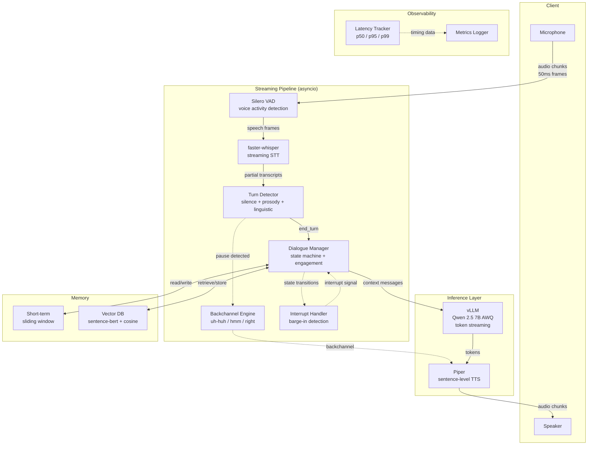
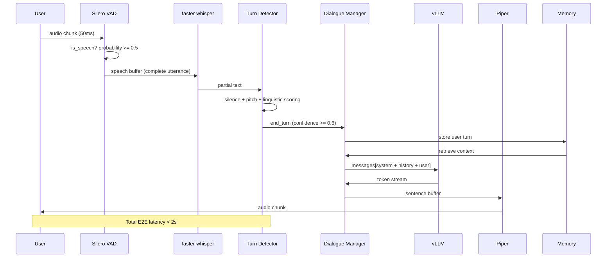

<div align="center">
  <br>
  <pre style="font-family: 'Fira Code', monospace; font-size: 1.4em; background: #0d1117; color: #58a6ff; padding: 1.5em 2em; border-radius: 12px; border: 1px solid #30363d; letter-spacing: 1px;">
╔══════════════════════════════════════════════════╗
║   ████████ ║  █████  ███████  █████              ║
║      ██    ║ ██   ██ ██      ██   ██             ║
║      ██    ║ ███████ ███████ ███████             ║
║      ██    ║ ██   ██      ██ ██   ██             ║
║      ██    ║ ██   ██ ███████ ██   ██             ║
╚══════════════════════════════════════════════════╝
  </pre>
  <h3 align="center" style="font-weight: 400; color: #8b949e;">
    Turn-Aware Speech Agent
  </h3>
  <p align="center" style="font-size: 1.1em; color: #c9d1d9; max-width: 600px;">
    A real-time Conversational AI Voice Agent that listens, understands, and responds<br>
    with human-like timing, awareness, and natural flow.
  </p>
  <br>
  <p>
    <a href="#architecture"><kbd>Architecture</kbd></a>
    <a href="#features"><kbd>Features</kbd></a>
    <a href="#stack"><kbd>Stack</kbd></a>
    <a href="#quick-start"><kbd>Quick Start</kbd></a>
    <a href="#pipeline"><kbd>Pipeline</kbd></a>
    <a href="#testing"><kbd>Testing</kbd></a>
  </p>
  <br>
</div>

---

## About TASA

TASA is not a command-response bot. It is a **conversational partner** that:

- **Listens** continuously via streaming speech-to-text
- **Thinks** with token-by-token LLM generation via vLLM
- **Speaks** with low-latency sentence-level TTS
- **Times** responses using silence + prosody + linguistic cues
- **Handles interruptions** -- barge-in when the user cuts in
- **Backchannels** naturally -- "uh-huh", "hmm", "right" at the right moment
- **Maintains dialogue state** -- knows when to listen, think, speak, or wait

---

<a name="architecture"></a>
## System Architecture



---

<a name="features"></a>
## Core Capabilities

### Real-Time Streaming Pipeline
| Stage | Latency Target | Mechanism |
|-------|----------------|-----------|
| Audio Ingestion | < 50ms | 16kHz, 800-byte frames via WebSocket binary |
| VAD | < 30ms | Silero VAD -- per-frame speech probability |
| STT | < 500ms | faster-whisper base on CPU, partial transcripts |
| Turn Detection | < 200ms | Fusion: silence + pitch trend + filler words |
| LLM Streaming | < 100ms TTFT | vLLM with PagedAttention, token-by-token SSE |
| TTS | < 100ms/sentence | Piper -- phoneme-level synthesis, no GPU needed |

### Dialogue State Machine
```
                  +----------+
                  |   IDLE    |
                  +----+-----+
                       | user starts speaking
                       v
              +-------------------+
    +-------->|    LISTENING      |<-------------------+
    |         +--------+----------+                    |
    |                  | pause > 400ms                  |
    |         +--------v----------+                    |
    |         |   BACKCHANNEL     |--- brief ack ------+
    |         +--------+----------+
    |                  | turn complete
    |                  v
    |         +-------------------+
    |         |   PROCESSING      |
    |         +--------+----------+
    |                  | LLM starts streaming
    |                  v
    |         +-------------------+
    |         |   RESPONDING      |
    |         +--------+----------+
    |                  | first token sent
    |                  v
    |         +-------------------+
    |         |  INTERRUPTIBLE    |<---- user barge-in
    |         +--------+----------+
    |                  | response done        |
    +------------------+                     |
           +----------+                     |
           |   IDLE   |<--------------------+
           +----------+
```

### Turn-Taking Intelligence
- **Silence threshold** -- configurable (default 600ms)
- **Prosody analysis** -- pitch trajectory (rising = question, falling = end)
- **Linguistic cues** -- filler words ("um", "uh"), trailing conjunctions ("and...", "but..."), question detection
- **Weighted fusion** -- 50% silence + 30% prosody + 20% linguistic to single confidence score

### Backchanneling
- Triggered on pauses **> 400ms** during user speech
- Context-aware selection -- acknowledging, agreeing, surprised, thinking, sympathetic
- Cooldown **3s** between backchannels to avoid sounding robotic
- Weighted candidate pool: `["uh-huh", "hmm", "right", "yeah", "i see", "okay"]`

### Memory System
| Type | Storage | Retrieval |
|------|---------|-----------|
| Short-term | Rolling window of last 10 turns | Sliding window context for LLM |
| Long-term | Sentence-BERT embeddings + cosine search | Top-k similar past conversations |
| Token budget | Auto-truncate to 4096 tokens | Promotes recent + relevant entries |

---

<a name="stack"></a>
## Technology Stack

| Component | Technology | Why |
|-----------|-----------|-----|
| **VAD** | [Silero VAD](https://github.com/snakers4/silero-vad) | Best accuracy-per-latency, per-frame inference |
| **STT** | [faster-whisper](https://github.com/SYSTRAN/faster-whisper) | CTranslate2 backend, 4x faster than OpenAI Whisper |
| **LLM** | [vLLM](https://github.com/vllm-project/vllm) + Qwen 2.5 7B AWQ | PagedAttention, continuous batching, token streaming |
| **TTS** | [Piper](https://github.com/rhasspy/piper) | Sub-100ms per sentence, no GPU required, many voices |
| **Server** | FastAPI + Uvicorn | Async-native, WebSocket support, high concurrency |
| **Memory** | sentence-transformers | all-MiniLM-L6-v2, 384-dim embeddings |
| **Infra** | Docker Compose | vLLM (GPU) + TASA (CPU) as linked services |

---

<a name="quick-start"></a>
## Quick Start

### Local Development

```bash
# 1. Clone and create environment
python3 -m venv venv
source venv/bin/activate

# 2. Install TASA with all providers
pip install --editable ".[all]"

# 3. Start vLLM (separate terminal, requires GPU)
docker run --gpus all -p 8001:8000 \
  vllm/vllm-openai \
  --model Qwen/Qwen2.5-7B-Instruct-AWQ \
  --max-model-len 4096 \
  --gpu-memory-utilization 0.90 \
  --dtype float16 \
  --quantization awq

# 4. Run TASA server
tasa server
```

### Docker (Full Stack)

```bash
# Start everything -- vLLM + TASA
docker compose up

# Services:
#   localhost:8000  -> TASA WebSocket server
#   localhost:8001  -> vLLM OpenAI-compatible API

# Configuration via .env:
#   TASA_LLM_MODEL, TASA_STT_MODEL, TASA_TTS_MODEL, etc.
```

### Local Mic Demo

```bash
tasa demo --llm-url http://localhost:8001/v1
```

---

<a name="pipeline"></a>
## End-to-End Data Flow



---

<a name="testing"></a>
## Testing

```bash
# Run all unit tests (20 tests across state, turn, memory, classifier)
pytest tests/ -v

# Expected output:
#   tests/test_memory.py .....
#   tests/test_state.py ......
#   tests/test_turn.py .........
#   20 passed in 0.15s
```

### Test Coverage

| Module | Tests | What's Covered |
|--------|-------|-----------------|
| `test_state.py` | 6 | Session state, turns, dialogue FSM, engagement |
| `test_turn.py` | 9 | Turn detector, classifier (questions, fillers, prosody), interrupt handler |
| `test_memory.py` | 5 | Session memory, vector DB, retrieval module |

---

<a name="project-structure"></a>
## Project Structure

```
tasa/
├── app/                    # Entrypoints & API
│   ├── server.py           # FastAPI app with lifespan pipeline
│   ├── cli.py              # CLI: server / demo / metrics
│   └── routes/
│       ├── ws.py           # WebSocket: multi-session audio streaming
│       └── health.py       # Health check endpoint
│
├── core/                   # Orchestration
│   ├── pipeline.py         # Async streaming pipeline (VAD->STT->LLM->TTS)
│   ├── state.py            # Dialogue FSM + session state + engagement
│   ├── dialogue_manager.py # State transitions, backchannel decisions
│   └── config.py           # Core configuration
│
├── providers/              # Plug-and-play model interfaces
│   ├── stt/
│   │   ├── base.py                     # Streaming STT ABC
│   │   └── faster_whisper_stt.py       # faster-whisper implementation
│   ├── llm/
│   │   ├── base.py                     # Streaming LLM ABC
│   │   └── vllm_llm.py                # vLLM OpenAI client
│   └── tts/
│       ├── base.py                     # Streaming TTS ABC
│       └── piper_tts.py               # Piper TTS (Python API)
│
├── modules/                # AI & signal processing modules
│   ├── vad/
│   │   └── silero_vad.py              # Silero VAD wrapper
│   ├── turn/
│   │   ├── detector.py    # Fusion: silence + prosody + linguistic
│   │   ├── classifier.py  # Weighted scoring engine
│   │   ├── features.py    # Audio feature extraction
│   │   ├── interrupt.py   # Barge-in detection
│   │   └── timing.py      # Response timing heuristics
│   ├── prosody/
│   │   ├── extractor.py   # Pitch, energy, ZCR extraction
│   │   └── analyzer.py    # Prosodic trajectory analysis
│   ├── backchannel/
│   │   ├── generator.py   # Context-aware backchannel selection
│   │   └── timing.py      # Emission timing logic
│   ├── dialogue/
│   │   ├── manager.py     # Conversation decision engine
│   │   ├── intent.py      # Intent classification
│   │   ├── memory.py      # Dialogue memory
│   │   └── prompts.py     # System prompt templates
│   ├── memory/
│   │   ├── session.py     # Session sliding window memory
│   │   ├── vector_db.py   # Sentence-BERT embedding store
│   │   └── retrieval.py   # Short + long term context fusion
│   ├── audio/
│   │   ├── input.py       # Audio input handler
│   │   ├── output.py      # Audio playback handler
│   │   └── processing.py  # Chunking, resampling
│   └── metrics/
│       ├── latency.py     # Per-stage p50/p95/p99 histograms
│       └── logger.py      # Structured event logging
│
├── streaming/              # Legacy streaming (deprecated)
│   ├── pipeline.py
│   ├── queues.py
│   └── workers/
│
├── tests/                  # 20 passing unit tests
│   ├── test_state.py
│   ├── test_turn.py
│   └── test_memory.py
│
├── utils/                  # Shared utilities
│   ├── timers.py
│   ├── audio.py
│   └── logger.py
│
├── configs/                # Runtime configuration
├── Dockerfile              # Multi-stage: builder + slim runtime
├── docker-compose.yml      # vLLM (GPU) + TASA (CPU)
├── .env                    # Default environment variables
└── pyproject.toml          # Project metadata & dependencies
```

---

<a name="configuration"></a>
## Configuration

All via environment variables or `.env`:

| Variable | Default | Description |
|----------|---------|-------------|
| `TASA_STT_MODEL` | `base` | faster-whisper model size |
| `TASA_STT_DEVICE` | `cpu` | STT device (`cpu` or `cuda`) |
| `TASA_STT_COMPUTE` | `int8` | Compute type for CTranslate2 |
| `TASA_LLM_URL` | `http://vllm:8000/v1` | vLLM API base URL |
| `TASA_LLM_MODEL` | `Qwen/Qwen2.5-7B-Instruct-AWQ` | LLM model name |
| `TASA_TTS_MODEL` | `/app/models/piper/en_US-lessac-medium.onnx` | Piper voice model path |
| `TASA_VAD_THRESHOLD` | `0.5` | VAD speech probability threshold |
| `TASA_VLLM_MAX_LEN` | `4096` | vLLM max context length |
| `TASA_VLLM_GPU_UTIL` | `0.90` | vLLM GPU memory utilization |
| `TASA_VLLM_DTYPE` | `float16` | vLLM inference dtype |

---

<a name="api"></a>
## WebSocket API

Connect to `ws://localhost:8000/ws/audio` with binary audio frames:

**Client to Server** (binary frames):
- 16kHz mono 16-bit PCM audio chunks (800 bytes = 50ms each)

**Server to Client** (JSON text frames):

| Event | Fields | Description |
|-------|--------|-------------|
| `speech_start` | `{"type": "speech_start"}` | User starts speaking |
| `speech_end` | `{"type": "speech_end"}` | User stops speaking |
| `transcript` | `{"type": "transcript", "text": "..."}` | Final STT output |
| `llm_token` | `{"type": "llm_token", "token": "..."}` | One LLM token |
| `llm_done` | `{"type": "llm_done", "text": "..."}` | Complete LLM response |
| `backchannel` | `{"type": "backchannel", "text": "..."}` | Listener acknowledgment |
| `interrupt` | `{"type": "interrupt"}` | Barge-in detected |

**Server to Client** (binary frames):
- Raw 16-bit PCM audio chunks from TTS (22050Hz mono)

---

## Latency Budget (Target)

```
Audio In -> VAD:        < 30ms
VAD -> STT:             < 500ms
STT -> Turn Detector:   < 200ms
Turn Detector -> LLM:   < 100ms (first token)
LLM -> TTS:             < 100ms (per sentence)
TTS -> Speaker:         < 50ms
---------------------------------------
Total E2E:              < 1.5s (goal)
```

---

<div align="center">
  <br>
  <p style="color: #8b949e; font-size: 0.9em;">
    Built with ❤️ for natural, flowing conversation.
  </p>
  <br>
</div>
